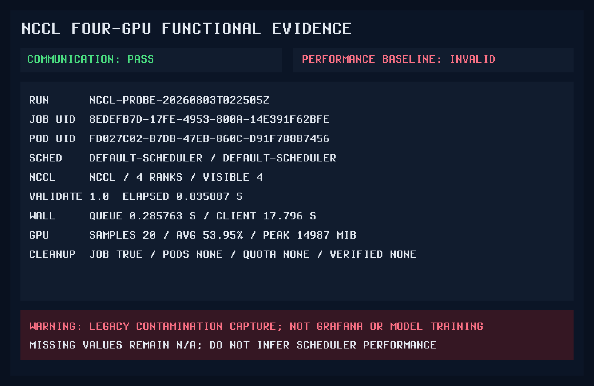
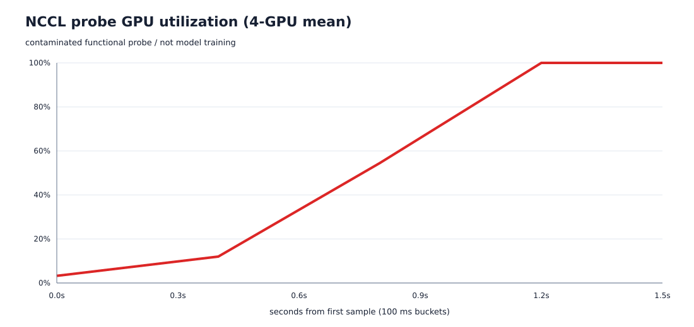
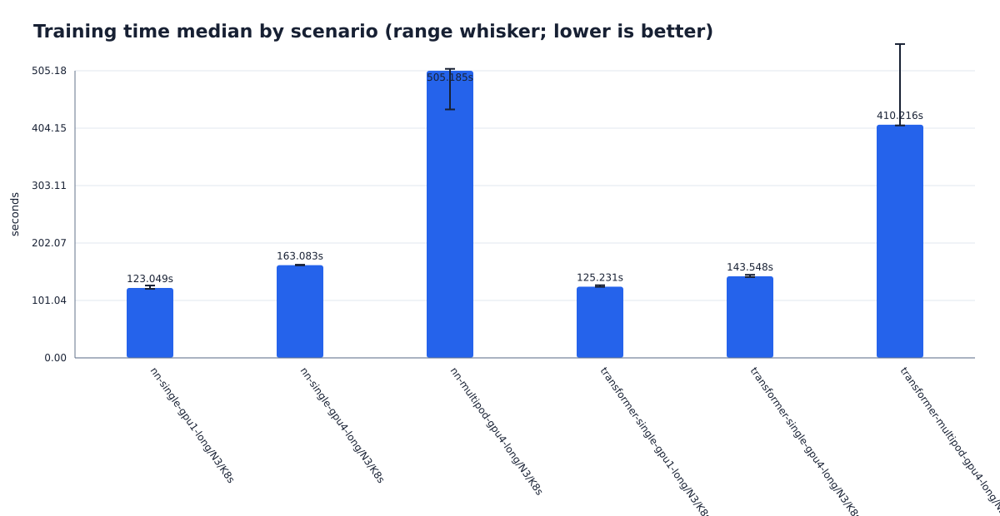
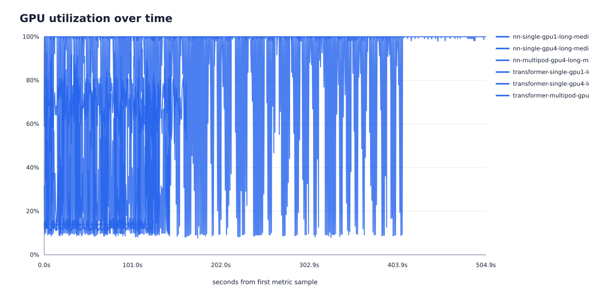
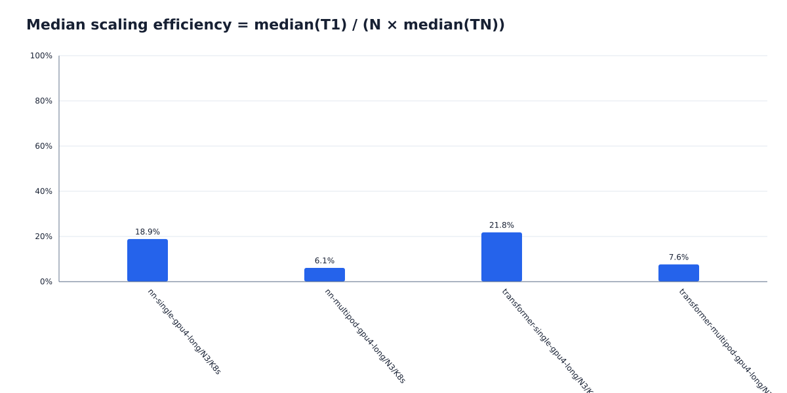

# Native Kubernetes GPU 长时强缩放复测报告

> 这是生成器保留的 attempt-level 审计视图；正式实验文档请见：[GPU 长时强缩放复测](../../../docs/experiments/GPU长时强缩放复测-2026-08-04.md)。  
> 正式结论以 `docs/` 下的 Markdown 为准；本文件只保留生成式诊断和逐次证据。

## 结论先行

| 结论层级 | 当前结论 |
|---|---|
| 目标生产执行架构 | **建议 Phase 1 普通多租户训练默认使用 Kueue admission + `default-scheduler`；严格整组启动任务先通过真实 scaling gate，再进入隔离的 Volcano Queue/PodGroup pilot；Native K8s 只保留简单隔离任务和性能基线。** |
| 性能赢家 | **尚不能判定跨调度器性能赢家。** 当前已完成 `6/6` 个矩阵单元，存在真实 Training Time 与 GPU utilization，并已形成同指纹 Scaling Efficiency；本矩阵不能据此做三调度器性能排名。 |
| 已实测调度能力 | Native ResourceQuota、Kueue quota/整组准入/quota preemption、Volcano Queue/Gang/条件式 preemption 均在 2026-07-31 实际执行并形成 N=1 完整效果链；见下一节 9 行 wall-clock 表。 |
| 当前执行状态 | host GPU compute process 的最新只读快照为 **0**；该易变 gate 当前已解除；所选 synthetic_ephemeral 授权契约有效，不挂 PVC/hostPath；使用 512Mi memory-backed emptyDir；本轮长时矩阵已完成；尚未关闭的是正式生产所需的监控、独立存储和多节点复验。 |

### 对 Q1–Q3 的直接回答

| 问题 | 结论 | 证据边界 |
|---|---|---|
| Q1 不同模型是否需要不同调度策略？ | **按 workload 语义分流，不按模型名硬编码。** 简单独立 LGB/NN 可走 Native；普通多租户训练走 Kueue；只有要求严格整组启动或 PodGroup 语义的分布式任务才走 Volcano。Transformer 不天然等于 Volcano。 | 来自调度功能实测与产品语义；尚无三调度器同模型性能比较。 |
| Q2 Single Pod 与 Multi Pod 性能差异？ | **已有原生 K8s 长时 Single/Multi-Pod 实测差异。** 该结果可用于区分单 Pod DDP 与同节点多 Pod 拓扑成本；不能替代多节点或 Kueue/Volcano 同负载对照。 | 以本报告第 3 节的 UID-linked completed runs 为准；旧 4-GPU NCCL 探针只作独立功能证据。 |
| Q3 Kueue 还是 Volcano？ | **Phase 1 建议选 Kueue + default-scheduler；Volcano 作为 feature-gated strict-gang pilot。** 同一 Job 只能有一个 admission/queue owner。 | 这是 capability/risk 架构建议，不是当前投产批准或性能冠军结论。 |

## 已验证功能效果与 wall-clock

> 下表是 2026-07-31 实际执行的 N=1 调度功能测试，不是 LGB/NN/Transformer 训练性能。PASS 表示对应调度链实际生效。

| Scheduler | 实际生效链 | 结论 |
|---|---|---|
| Native K8s | ResourceQuota 达到 4 GPU 时拒绝 Pod 创建；holder 释放后 Job controller 重试并完成 | PASS（2026-07-31 实测 N=1；硬配额，不是 batch queue） |
| Kueue | CUDA Admission、ClusterQueue quota 等待/释放、两成员整组 quota Admission、低优先级 Workload eviction→高优先级启动 | PASS（2026-07-31 实测 N=1；临时测试 Queue 已清理，当前 LocalQueue 不存在） |
| Volcano | CUDA、Queue capability、minMember/minResources 阈值上下绑定、临时 preempt action 下 victim→preemptor | PASS（2026-07-31 实测 N=1；临时配置已恢复，当前 preempt/reclaim 未启用） |

| Scheduler | 功能场景 | API Job wall s | Client submit→complete s |
|---|---|---:|---:|
| Bare K8s | ResourceQuota waiter | 44.000 | 44.452 |
| Kueue | GPU/CUDA admission | 9.000 | 8.934 |
| Kueue | quota waiter | 37.000 | 37.155 |
| Kueue | all-or-nothing admission | 21.000 | 21.669 |
| Kueue | preemptor | 15.000 | 15.625 |
| Volcano | GPU/CUDA smoke | 14.000 | 14.200 |
| Volcano | queue waiter | 44.000 | 44.190 |
| Volcano | Gang | 24.000 | 24.362 |
| Volcano | preemptor | 16.000 | 16.071 |

这些 wall-clock 含人为 hold/sleep 和 quota 等待，只用于证明时间链与调度效果，不能横向比较调度器快慢。

### Server-side dry-run 摘要（不等于训练）

旧 server-side dry-run capture 仅为提交前诊断，不再用来描述已经 completed 的模型单元。最新完成度、调度事件和训练结果以第 3 节及对应 orchestration/raw evidence 为准。

### 实际效果截图（2026-07-31 实测 N=1）

**Native K8s ResourceQuota 拒绝与释放后重试**


**Kueue GPU Admission 与 CUDA**


**Kueue ClusterQueue GPU quota 等待/释放**


**Kueue 整组 quota Admission**


**Kueue quota preemption**


**Volcano GPU/CUDA 与 wall-clock**


**Volcano Queue capability**


**Volcano Gang minMember/minResources**


**Volcano 条件式 preemption**


## 报告状态与证据边界

> 生成时间：`2026-08-04T03:30:15Z`  
> 报告性质：**COMPLETED LONG-RUN MATRIX：6/6 个场景、18/18 次重复均有 UID-linked completed 证据；长时扩展性结论已形成，生产基础设施门槛另行列示。**  
> 验收矩阵：`long-scaling-native-k8s-20260804`，来源 `/home/khalil/DataCleaning7.3/QuantFM/benchmark/config/long-scaling-native-k8s-20260804.json`；6 scenarios × 1 schedulers = 6 cells。  
> 矩阵边界：这是 2026-08-04 原生 K8s 长时强缩放复测矩阵：固定同模型全局工作量，NN timed steps=36,000、Transformer timed steps=320，每格 N=3；新增 NN Single-Pod 4-GPU 对照以拆分 GPU scaling 与 Pod topology。它验证稳态训练与端到端时间，不构成 Kueue/Volcano 长时性能对照。  
> Cell 覆盖度：`6/6`；重复次数完成度：`18/18`（每格要求 N=3）；实际训练/提交捕获：`18`（completed/blocked/failed：`18/0/0`）；未完成矩阵单元：`0`。  
> 清理验收：`18/18` 个 completed run 同时满足精确对象不存在、owner UID 依赖不存在和 GPU quota 恢复。  
> 执行阶段：completed=`18`，submitted-incomplete=`0`，server-dry-run=`0`，readiness-only=`0`。dry-run/readiness **不计为**模型实验完成。  
> 独立功能探针：4-GPU NCCL=`success_with_contamination_cleanup_unknown`；该探针不计入模型矩阵。  
> 本长时矩阵 6/6 场景、18/18 次重复均已完成，训练指标没有以 `N/A` 或 `blocked` 代替；范围外的 LGB、8-GPU、多节点和三调度器性能对照单独列为后续工作。

## 1. 环境介绍

| 项目 | 实测值 | 证据说明 |
|---|---:|---|
| GPU | NVIDIA GeForce RTX 5090 | 容器内 `nvidia-smi` |
| Driver | 595.71.05 | 容器内 `nvidia-smi` |
| GPU memory | 32607 MiB | 容器内 `nvidia-smi` |
| CUDA runtime 可用 | True | 环境探针 |
| PyTorch / CUDA build | 2.13.0+cu130 / 13.0 | 环境探针 |
| NCCL | 2.29.7 | 环境探针；仅表示库可见，不等于多节点通信已验证 |
| Kubernetes | v1.35.4+k3s1 / k3s | 只读 inventory |
| 节点 / GPU 节点数 | 1 / 1 | 只读 inventory；不是需求中假设的 8 个节点 |
| 单节点 allocatable GPU | 8 | `gpu-dev-01` inventory |
| Container runtime | containerd://2.2.3-k3s1 | Node status |
| Namespace GPU quota hard / used | 4 / 0 | `gpu-dev` ResourceQuota |
| Kueue / Volcano | v0.19.0 / v1.15.1 | 只读 Deployment inventory |
| GPU Operator / DCGM / Prometheus / Grafana | absent / absent / absent / absent | 只读 inventory |
| 当前矩阵 storage mode | `synthetic_ephemeral` | 授权契约有效；无 PVC/hostPath，512Mi memory-backed emptyDir，禁止下载/checkpoint/持久缓存/durable output |
| Benchmark PVC | gpu-dev/quantfm-data, 500Gi, local-path | backend admin confirmation=False; non-root disk=False |
| 未验证独立盘候选 | nvme0n1, 7T, INTEL SSDPF2KX076T9N, partition=LVM2_member | mounted=False; LVM metadata verified=False; **不能据此声称可用** |
| 历史 host GPU 进程捕获（已过期） | external host process=1, GPU index=7, memory≈13524 MiB, util≈7% | 仅解释 NCCL 探针污染；不能代表当前状态 |
| 最新只读 host process snapshot | at=2026-08-04T03:06:08.792Z, process=0, GPU UUID=N/A, memory≈N/A MiB | `benchmark/results/raw/khalil-bm-k8s-576fe3-nn-single-o96f3100c-c018-r02/preflight-host-gpu-processes.json`；这是当前易变状态 |

只读清点显示当前是 **1 个 GPU 节点、该节点 8 张 GPU**，不是“8 个 GPU 节点”。本长时矩阵按共享 quota 明确封顶 4 GPU；8-GPU 目标只属于 requested-target gap，不在本轮分母内。

`findmnt -T /data` 与 `findmnt -T /` 均指向 `/dev/mapper/ubuntu--vg-ubuntu--lv`：现有 `quantfm-data` local-path 实际位于根文件系统。它不被所选 synthetic_ephemeral Pod 挂载，因此不是本矩阵的当前硬阻塞；但仍会阻止 LGB、requested-target、production contention，以及任何会读写训练数据、缓存、日志、checkpoint 或 durable output 的任务。

只读块设备清点还看到 `nvme0n1`（约 7T，`INTEL SSDPF2KX076T9N`，7T 分区标记为 `LVM2_member`），但本次视图中未挂载，且当前身份无法读取 LVM 元数据。其所有权、既有数据和可用性均未确认；只能由存储管理员核验后配置为独立 PVC 后端，或改用已确认的独立 CSI。**发现设备不等于获准或可用。**

NCCL 探针捕获期曾发现 Kubernetes 资源记账不可见的 external host process，因此该旧探针不能用于性能排名。最新只读 readiness snapshot 显示 process count=0，该易变 gate 当前已解除；每个性能 run 仍须重新执行同次 preflight。

## 2. Benchmark 设计与计时口径

- 本报告只以 `long-scaling-native-k8s-20260804` 的 JSON 内容作为完成度分母；不会隐式追加另一个内置矩阵的单元。
- 矩阵存储模式：`synthetic_ephemeral`；当前授权契约有效，不挂载 PVC/hostPath，所有 scratch 位于 512Mi memory-backed emptyDir。

| Scenario ID | Model | Mode | GPU | Matrix execution |
|---|---|---|---:|---|
| nn-single-gpu1-long | NN | Single Pod | 1 | allowed |
| nn-single-gpu4-long | NN | Single Pod | 4 | allowed |
| nn-multipod-gpu4-long | NN | Multi Pod | 4 | allowed |
| transformer-single-gpu1-long | Transformer | Single Pod | 1 | allowed |
| transformer-single-gpu4-long | Transformer | Single Pod | 4 | allowed |
| transformer-multipod-gpu4-long | Transformer | Multi Pod | 4 | allowed |

- LightGBM CPU 与 GPU 场景分别记账；不同设备后端不能合并为一个性能样本。
- Transformer completed 结果必须证明真实 DDP/NCCL 链，而非仅证明 CUDA 可见。
- LightGBM 4.6.0 中 `device_type=gpu` 指 OpenCL 实现，`device_type=cuda` 是独立 CUDA 实现。当前候选内部镜像没有 digest-pinned `device_type=cuda` smoke 证据；不能凭 wheel 名称推断 backend，也不能填充目标 CUDA 单元。
- `queue_time`：客户端提交时刻到最后一个预期 Pod 的 UID-filtered `Scheduled` Event。
- `training_time`：仅取 workload 输出的 `BENCHMARK_RESULT_JSON`；不使用容器运行时长替代。
- `wall_clock_time`：客户端提交时刻到 Job API `completionTime`。
- `gpu_utilization`：采集到的设备样本算术平均；折线图把同一 `nvidia-smi` 快照中相差不足 100 ms 的多卡记录聚合为一个集群级时间点；无样本保持 N/A。
- Scaling efficiency：`T1 / (N × TN)`，只有同模型、同调度器、相同捕获容器 `imageID`，且 workload 明确发出相同 `scaling_fingerprint` 的 1 GPU/N GPU completed run 才计算；v3 指纹还锁定聚合 CPU/内存，steps/config/work units、主机资源或镜像身份不同均保持 N/A。
- 多 Pod 的 Job、Pod、Event、Workload 依靠 Kubernetes UID 关联；对象名称不参与时间事件匹配。

## 3. 本轮长时矩阵完成度与证据边界

完整机器可读尝试记录保存在 [benchmark_results.csv](benchmark_results.csv)；正文只展示覆盖度，不逐条重复 readiness/dry-run 记录。

| Scheduler | Required GPU cells | Completed training cells | Completion |
|---|---:|---:|---:|
| K8s | 6 | 6 | 6/6 |

本轮长时矩阵 **6/6 cells、18/18 runs** 全部完成。API dry-run 和历史功能测试不进入 completed training 分子；正文和图表均使用每格 N=3 中位数。

### 不影响本轮完成度的生产门槛与范围外缺口

| Gate | 当前状态 | 对真实训练的影响 |
|---|---|---|
| 训练存储 | 所选矩阵使用已授权的 `synthetic_ephemeral`：无 PVC/hostPath，512Mi memory-backed emptyDir | 本矩阵不受根盘 PVC 影响；target/LGB/持久任务仍需独立存储后再测 |
| Kueue | 不在本次长时矩阵；本轮未创建或修改任何 Kueue 对象 | 不能用本轮 Native 训练时间声称 Kueue 性能已复测 |
| Volcano | 不在本次长时矩阵；本轮未创建或修改任何 Volcano 对象 | 不能用本轮 Native 训练时间声称 Volcano 性能已复测 |
| 监控 | GPU Operator/DCGM/Prometheus/Grafana 未检测到 | 不影响本轮容器内计时结论；正式生产监控验收仍需补齐 |
| Host GPU process | 最新只读快照 process count=0 | 当前无此阻塞；每次性能 run 仍须重新检查 |
| LightGBM/8-GPU gap | 不属于所选矩阵的完成度分母 | 保留在 requested-target gap，不用 N/A 污染本轮长测完成度 |

### 3.1 本轮 4-GPU NCCL 通信探针（非训练、受污染）

机器可读摘要：[nccl_probe_result.json](nccl_probe_result.json)。

**实际效果截图（由原始 UID/Event/log JSON 可复现渲染；受污染；非 Grafana、非训练性能）**



**NCCL 探针 GPU 利用率（4 卡按 100 ms bucket 求均值；独立功能探针，不混入训练矩阵图）**



| 证据 | 值 | 结论 |
|---|---:|---|
| Job / Pod UID | `8edefb7d-17fe-4953-800a-14e391f62bfe` / `fd027c02-b7db-47eb-860c-d91f788b7456` | UID-filtered Job→Pod→Scheduled chain |
| Scheduler / node | default-scheduler / gpu-dev-01, Scheduled reporter=default-scheduler | UID/Event binding verified |
| NCCL | status=success_with_contamination_cleanup_unknown, backend=nccl, version=2.29.7 | world_size=4, visible GPU=4, validation=1.0 |
| Collective | 0.835887 s, 50 × 64 MiB/rank | 4-rank all-reduce 通信链实际成功 |
| Raw payload rate | 4.014 GB/s | **contaminated；不得用于性能排名** |
| Queue / API Job / client wall | 0.285763 / 18.000 / 17.796 s | client wall=17.796s |
| Container runtime | 12.000 s | 包含启动、NCCL 初始化和探针 |
| GPU samples | n=20, avg util=53.95%, peak memory=14987 MiB, avg power=77.172 W | 聚合值包含外部进程负载 |
| Quality evidence | legacy captured summary; timestamped per-run preflight unavailable; preflight at=N/A | baseline valid=False |
| Cleanup | Job absent=True, owned Pods absent=N/A, quota used after=0, quota restored=N/A, verified=N/A | Partial/Unknown：不能声称精确清理链完整 |

**数据质量结论：通信功能 Pass，性能基线 Invalid（legacy capture）。** 该 run 自带 summary 明确记录分配卡受到 external host process 影响，但没有带时间戳的逐-run process snapshot；因此精确 GPU、显存和利用率细节有意不从异时 cluster inventory 拼接。解析器未执行任何外部进程操作；本探针不填充训练矩阵。


### 3.2 2026-08-04 长时强缩放复测（Native K8s）

本表只聚合本次 digest-locked 长时矩阵的 UID-linked completed runs。`E_train=T1_training/(N×TN_training)`；`E_wall=T1_wall/(N×TN_wall)`。两者分列，避免把调度/启动时间误算为训练效率。

| Scenario | Completed N | Queue median s | Training median s | Wall median s | Wall−training median s | GPU util median % | Throughput median | GPU samples/run median | E_train % | E_wall % |
|---|---:|---:|---:|---:|---:|---:|---:|---:|---:|---:|
| nn-single-gpu1-long | 3 | 0.305 | 123.049 | 136.813 | 13.982 | 13.94 | 1198356.259 | 211 | 100.00 | 100.00 |
| nn-single-gpu4-long | 3 | 0.289 | 163.083 | 184.595 | 21.696 | 69.71 | 904176.312 | 1024 | 18.86 | 18.53 |
| nn-multipod-gpu4-long | 3 | 0.688 | 505.185 | 537.663 | 30.872 | 99.83 | 291885.315 | 3471 | 6.09 | 6.36 |
| transformer-single-gpu1-long | 3 | 0.295 | 125.231 | 143.788 | 18.757 | 12.44 | 163.538 | 214 | 100.00 | 100.00 |
| transformer-single-gpu4-long | 3 | 0.299 | 143.548 | 166.384 | 21.887 | 35.39 | 142.670 | 880 | 21.81 | 21.60 |
| transformer-multipod-gpu4-long | 3 | 0.673 | 410.216 | 441.614 | 31.725 | 72.20 | 49.925 | 2436 | 7.63 | 8.14 |

N=3 离散范围如下；Multi-Pod 的波动明显大于 Single-Pod，因此生产 gate 不能只看一次最快结果。

| Scenario | Training min–max s | Wall min–max s | Queue min–max s | GPU util min–max % |
|---|---:|---:|---:|---:|
| nn-single-gpu1-long | 121.440–127.310 | 135.422–141.508 | 0.299–0.320 | 13.04–14.03 |
| nn-single-gpu4-long | 162.899–163.833 | 184.251–187.038 | 0.282–0.296 | 69.54–70.23 |
| nn-multipod-gpu4-long | 437.109–508.491 | 466.989–539.363 | 0.678–0.709 | 99.80–99.84 |
| transformer-single-gpu1-long | 125.031–127.812 | 143.703–148.774 | 0.287–0.296 | 12.44–13.04 |
| transformer-single-gpu4-long | 142.186–146.140 | 163.734–168.027 | 0.291–0.300 | 30.23–36.10 |
| transformer-multipod-gpu4-long | 408.943–552.156 | 440.668–588.189 | 0.660–0.682 | 72.20–82.23 |

解释：延长 timed training 会显著增加采样点并降低固定启动开销占比，但不会自动消除每 step 的 DDP collective、small per-rank batch 或跨 Pod NCCL 成本。
- NN 同为 4 GPU 时，Multi-Pod / Single-Pod：training=`3.10×`，wall=`2.91×`；该差异隔离的是同节点 Pod topology/NCCL 路径，不是 GPU 数。
- TRANSFORMER 同为 4 GPU 时，Multi-Pod / Single-Pod：training=`2.86×`，wall=`2.65×`；该差异隔离的是同节点 Pod topology/NCCL 路径，不是 GPU 数。

**对旧报告 `6.9%` 的直接结论：不是 wall-clock 固定开销造成。** 旧短测 NN Multi-Pod 4-GPU 的 `E_train=6.90%`；本次将 timed training 延长到约 505.2s 后，N=3 中位 `E_train=6.09%`，独立计算的 `E_wall=6.36%`。两种口径方向一致，而 queue time 仅约 0.69s。长测因此确认瓶颈在当前 workload/DDP/Pod 拓扑，不是调度等待或 wall-clock 公式。

## 4. 调度能力详细分析

下表只认可本次结果包内的完整证据链。软件文档中存在某能力，不等于本集群已验证。

| 能力 | Native K8s | Kueue | Volcano |
|---|---|---|---|
| Queue | No native batch queue；历史 N=1 ResourceQuota controller 重试不等于排队 Admission | Historical N=1 verified: Workload waited/admitted；current gpu-dev LocalQueue=absent | Historical N=1 verified: Queue gated waiter；不代表当前测试 Queue 仍存在 |
| Quota | Verified N=1: ResourceQuota 硬上限拒绝 Pod 创建并由 Job controller 重试；不是 batch quota | Historical N=1: nominal GPU quota, 7 个物理 GPU 空闲时 Workload 仍等待 | Historical N=1: Queue GPU capability wait/release |
| Priority | Kubernetes 有 Pod Priority；本轮 Native-only priority 场景 N/A | Historical only: priority 100/1000 was preemption input | Historical only: priority 100/1000 was temporary-test input |
| Preemption | N/A in selected Native run：namespace quota 阻止构造 node-pressure victim；不能据历史不完整样本判定 | Historical N=1: victim Evicted → high-priority Workload started；current gpu-dev LocalQueue=absent | Historical N=1 under temporary `preempt` action: victim → preemptor；current preempt=false, reclaim=false |
| Gang Scheduling | No native gang primitive in default scheduler | Partial: all-or-nothing quota Admission verified, not physical binding barrier；current waitForPodsReady=not_explicitly_enabled (example block is commented), Topology objects=0；TAS/waitForPodsReady candidate not tested | Historical N=1: below/above minMember/minResources and both bindings；current gang preemptable=false |
| Multi GPU | Observed — 12 个完成的多 GPU run（仅证明执行链）；独立 NCCL probe=contaminated | Partial (prior N=1): 2-GPU PodSet scheduled；无 NCCL/DDP | Partial (prior N=1): 2-member/2-GPU Gang；无 NCCL/DDP |
| Multi User/Fair Sharing | N/A — ResourceQuota 可分 namespace 硬隔离，但本轮未完成公平共享压力测试 | N/A — current fairSharing=not_explicitly_enabled (configuration block is commented), admissionFairSharing=not_explicitly_enabled (configuration block is commented), Cohort=none；未完成压力测试 | N/A — DRF/proportion 插件存在不等于本轮已验证多用户公平性 |

以上 `prior N=1 functional test` 来自 2026-07-31 的调度功能评估 JSON：[bare](../../../docs/assets/gpu-scheduler-evaluation/current-bare-results.json), [kueue](../../../docs/assets/gpu-scheduler-evaluation/current-kueue-results.json), [volcano](../../../docs/assets/gpu-scheduler-evaluation/volcano-results.json)。它们验证调度语义，不是 LGB/NN/Transformer 训练性能样本，未写入本轮 throughput/scaling 计算。

原生 Kubernetes 基线能够绑定独立 Pod，但没有批队列语义；ResourceQuota 的 Pod 创建拒绝也不能等同于 Kueue/Volcano 的队列 Admission。

**当前配置与历史功能探针必须分开解释。** 2026-08-03 只读清点显示：Kueue 的 `waitForPodsReady`、`fairSharing`/`admissionFairSharing` 仅出现在注释模板中，Topology 对象数为 0，且 `gpu-dev` 没有 LocalQueue；不能声称这些能力当前已启用。Volcano 当前 actions 为 `enqueue, allocate, backfill`，没有 `preempt`/`reclaim`，且 gang `enablePreemptable=false`。因此 2026-07-31 在临时配置下通过的 Volcano preemption 只是历史功能证据，不是当前生产配置状态。
### 4.1 既有功能实测 wall clock（N=1，非训练性能）

| Scheduler | 功能场景 | API Job wall s | Client submit→complete observed s |
|---|---|---:|---:|
| Bare K8s | ResourceQuota waiter | 44.000 | 44.452 |
| Kueue | GPU/CUDA admission | 9.000 | 8.934 |
| Kueue | quota waiter | 37.000 | 37.155 |
| Kueue | all-or-nothing admission | 21.000 | 21.669 |
| Kueue | preemptor | 15.000 | 15.625 |
| Volcano | GPU/CUDA smoke | 14.000 | 14.200 |
| Volcano | queue waiter | 44.000 | 44.190 |
| Volcano | Gang | 24.000 | 24.362 |
| Volcano | preemptor | 16.000 | 16.071 |

这些探针含人为 hold/sleep、不同应用时长以及等待配额的设计；它们仅用于验证 timestamp/effect chain，**不能用于 K8s、Kueue、Volcano 的快慢排名**。模型性能比较只读取第 3 节矩阵。

## 5. 最终推荐架构与决策规则

**长时扩展性结论：已形成（6/6 cells、18/18 runs）。** 本轮不再以 `BLOCKED` 描述性能结果；生产监控、持久存储和多节点验证是部署门槛，不会抹掉已经完成的训练计时。

- `E_train` 只使用容器上报的 timed training，不含排队、Pod 启动、模型构建和 warmup；因此低扩展效率不是由 wall-clock 固定开销算出来的。
- `E_wall` 独立列示并得到相同方向的结论；queue median 只有约 0.3–0.7 秒，相对 123–505 秒的 training time 很小，default-scheduler 不是本轮无竞争运行的性能瓶颈。
- 同一模型 4 GPU 的 Multi-Pod 明显慢于 Single-Pod，说明当前单节点实现的 Pod 间 NCCL/DDP 路径比单 Pod 多进程路径代价更高；高 GPU utilization 不能替代吞吐和 scaling efficiency。
- 本轮只比较 Native K8s 下的训练拓扑，不进行 K8s/Kueue/Volcano 性能排名。调度功能证据仍支持 Phase 1 默认采用 Kueue，Volcano 仅承接通过 scaling gate 的 strict-Gang pilot。

决策规则：

1. 小模型/多用户：只有 Kueue 的配额等待、优先级、抢占、公平共享和恢复链均通过，且对训练时间无显著回归时，才选择 Kueue。
2. 大模型/分布式：Transformer 本身并不天然“必须 Volcano”。应在相同 workload 下比较 Volcano PodGroup/Gang 与 Kueue TAS + `waitForPodsReady`；只有目标 Pod 数上下、真实 NCCL/DDP、失败恢复和租户隔离都通过后才选择。当前集群两条路径都未完成该验证。
3. 原生 K8s：适合无需批 Admission 的独立任务基线；不能用 ResourceQuota 替代队列系统。
4. 混合架构：必须先验证 Kueue 与 Volcano 的控制面责任边界，避免同一 workload 被双重 Admission 或由错误 scheduler 绑定。
5. 性能裁决：每个矩阵单元至少重复多次，报告 median/p95、冷/热镜像两组数据，并把数据加载与训练阶段分开计时。

推荐架构（长时复测后保持不变）：

```text
Kubernetes
    |
+---+--------------------------------------+
|                                          |
Normal/multi-tenant lane                    Strict gang lane
Kueue admission (single owner)              Volcano Queue/PodGroup (single owner)
    |                                          |
default-scheduler                          volcano scheduler
```

## 6. Grafana / 监控证据

**本轮未采集 Grafana。** 只读 inventory 为 `gpu_operator=absent, dcgm_exporter=absent, prometheus=absent, grafana=absent`。长时训练指标来自每个 Job 内的 `nvidia-smi` 采样；这不影响本轮 Training/Wall/Scaling 结论，但正式生产仍需补齐 DCGM Exporter → Prometheus → Grafana 监控链。

## 7. 可复现性与限制

- 每行结果保留 run_id、原因和证据目录；解析器对 Event 使用 involvedObject UID。
- 本轮三张性能 SVG 均使用每格 N=3 中位数；Training 图同时保留 min–max 误差线。
- 目前的平均 GPU 利用率是采集样本算术平均，不是 Prometheus 区间加权平均。
- 未验证的数据集规模、模型收敛质量、跨节点网络带宽、存储吞吐和 checkpoint 恢复不能从本次 bounded synthetic workload 推断。
- 8-GPU 场景超出本轮 4-GPU quota 与授权范围，属于后续矩阵；本报告不把它混入 6/6 完成度。
- 所选 synthetic_ephemeral 矩阵不挂载 local-path PVC，且不得产生持久数据；现有 local-path PVC 与 `/` 同一文件系统，仍不得用于 target/LGB/production 或任何持久 benchmark。
- 块设备清点中的 7T NVMe 只是未验证候选；管理员核实 LVM/既有数据并显式提供 PVC 之前，不得声称该设备可用。

## 8. 官方依据

> 以下链接说明上游产品的设计能力；**文档能力不等于本集群实测通过**。本报告的 Pass/Verified 只来自前述 UID、Event、Condition、日志和指标证据。链接于 2026-08-03 核对。

- Kueue：[ClusterQueue 与 quota](https://kueue.sigs.k8s.io/docs/concepts/cluster_queue/)、[运行 Kubernetes Job](https://kueue.sigs.k8s.io/docs/tasks/run/jobs/)、[All-or-nothing 的机制与限制](https://kueue.sigs.k8s.io/docs/concepts/all_or_nothing/)、[v0.19 TAS workload](https://kueue.sigs.k8s.io/v0.19/docs/tasks/run/topology_aware_scheduling/)、[waitForPodsReady](https://kueue.sigs.k8s.io/docs/tasks/manage/setup_wait_for_pods_ready/)。
- Volcano：[Queue resource management](https://volcano.sh/docs/keyfeatures/queueresourcemanagement/)、[Gang plugin](https://volcano.sh/docs/scheduler/plugins/gang/)、[PodGroup](https://volcano.sh/docs/concepts/podgroup/)。
- Kubernetes：[ResourceQuota](https://kubernetes.io/docs/concepts/policy/resource-quotas/)、[GPU scheduling](https://kubernetes.io/docs/tasks/manage-gpus/scheduling-gpus/)、[Pod Priority and Preemption](https://kubernetes.io/docs/concepts/scheduling-eviction/pod-priority-preemption/)。
- NVIDIA：[GPU Operator 安装](https://docs.nvidia.com/datacenter/cloud-native/gpu-operator/latest/getting-started.html)、[DCGM Exporter 安装与验证](https://docs.nvidia.com/datacenter/dcgm/latest/installation/install-dcgm-exporter.html)。
- LightGBM：[4.6.0 Installation Guide](https://lightgbm.readthedocs.io/en/v4.6.0/Installation-Guide.html)（OpenCL `device_type=gpu` / `USE_GPU` 与独立 CUDA `device_type=cuda` / `USE_CUDA` 构建）。

## 汇总附录 A：长时模型性能矩阵（N=3 中位数）

> 六个 cell 均完成 N=3；本表显示每格中位数，min–max 范围见第 3.2 节，不存在用 `N/A` 或 `blocked` 代替的训练指标。

| Scenario | Scheduler | Mode | GPU | Aggregation | Training s | Wall s | GPU util % | Scaling eff. % |
|---|---|---|---:|---|---:|---:|---:|---:|
| nn-single-gpu1-long | K8s | Single Pod | 1 | median (N=3) | 123.049 | 136.813 | 13.94 | 100.00 |
| nn-single-gpu4-long | K8s | Single Pod | 4 | median (N=3) | 163.083 | 184.595 | 69.71 | 18.86 |
| nn-multipod-gpu4-long | K8s | Multi Pod | 4 | median (N=3) | 505.185 | 537.663 | 99.83 | 6.09 |
| transformer-single-gpu1-long | K8s | Single Pod | 1 | median (N=3) | 125.231 | 143.788 | 12.44 | 100.00 |
| transformer-single-gpu4-long | K8s | Single Pod | 4 | median (N=3) | 143.548 | 166.384 | 35.39 | 21.81 |
| transformer-multipod-gpu4-long | K8s | Multi Pod | 4 | median (N=3) | 410.216 | 441.614 | 72.20 | 7.63 |







- `nn-single-gpu1-long`：N=3，training median=`123.049s`；Native-only 矩阵不进行跨 scheduler 排名。
- `nn-single-gpu4-long`：N=3，training median=`163.083s`；Native-only 矩阵不进行跨 scheduler 排名。
- `nn-multipod-gpu4-long`：N=3，training median=`505.185s`；Native-only 矩阵不进行跨 scheduler 排名。
- `transformer-single-gpu1-long`：N=3，training median=`125.231s`；Native-only 矩阵不进行跨 scheduler 排名。
- `transformer-single-gpu4-long`：N=3，training median=`143.548s`；Native-only 矩阵不进行跨 scheduler 排名。
- `transformer-multipod-gpu4-long`：N=3，training median=`410.216s`；Native-only 矩阵不进行跨 scheduler 排名。

## 审计附录 B：18 次原始运行索引

- 捕获尝试总数：`18`；completed=`18`，server-dry-run=`0`，readiness-only=`0`。
- 完整逐-run status、reason 与 evidence directory：[benchmark_results.csv](benchmark_results.csv)。
- 这些原始诊断保留在机器可读文件中，不在正文重复展开。
