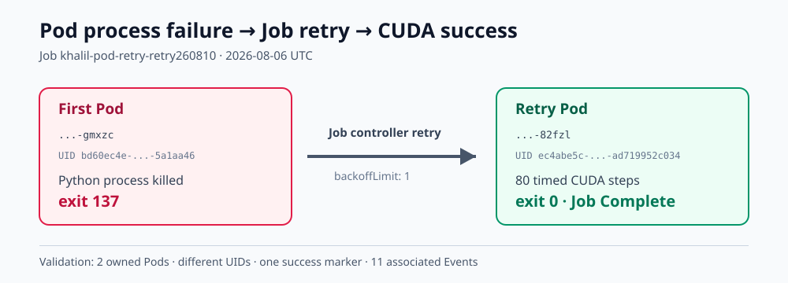
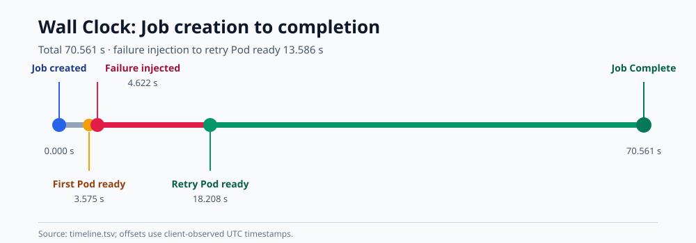

# Pod 进程故障与 Kubernetes Job 重试实验

## 1. 结论

重试机制按预期工作。

首个 Pod 的训练进程被强制终止，容器退出码为 137。Job controller 随后新建Pod；新 Pod 的 UID 与首个 Pod 不同，并以退出码 0 完成 80 步 CUDA 训练。Job最终进入 Complete 状态。

这次检查覆盖的是 `restartPolicy: Never`、`backoffLimit: 1` 下的进程故障和Pod 重建，不包括 checkpoint 恢复、节点故障和抢占后恢复。

## 2. 实验设计

实验目的为检查训练进程异常退出后，Job 能否按设定次数重新创建 Pod，并在新 Pod中正常完成 GPU 训练。

| 项目 | 配置 |
|---|---|
| Job | `khalil-pod-retry-retry260810` |
| Namespace | `gpu-dev` |
| 调度器 | `default-scheduler` |
| GPU | 1 × NVIDIA RTX 5090 |
| 镜像 | `registry.zs/gpu-dev/dylan-trainer@sha256:9e7f7f8dc3c15c522408d1e8da38401ac224b99ddfba363078f40403eb456574` |
| 重试策略 | `restartPolicy: Never`，`backoffLimit: 1` |
| 截止时间 | 300 秒 |
| 存储 | 512Mi 内存型 `emptyDir`；无 PVC/hostPath |
| 训练 | MLP，warm-up 10 步，计时 80 步，batch 4096，BF16 |

实验过程：

1. 提交前检查权限、ResourceQuota、正在运行的 GPU Pod 和主机 GPU 计算进程。
2. 通过 server-side dry-run 后创建 Job，保存 Job UID。
3. 首个 Pod 输出 `attempt_started` 后，保存 Pod UID 和容器进程清单。
4. 在 45 秒观察窗口内终止训练 Python 子进程。
5. 等待 Job controller 创建第二个 Pod。
6. 新 Pod 完成 CUDA 训练后，核对 Job 状态、两个容器的退出码和训练成功标记。
7. 按名称和 UID 删除本轮对象，再检查 Pod、GPU 配额和主机 GPU 计算进程。

## 3. 实验结果

从故障注入完成到重试 Pod 进入实验窗口用时 13.586 秒；从创建 Job 到 Job
Complete 共用时 70.561 秒。重试 Pod 的 CUDA 计时部分为 0.306726 秒。

| 指标 | 结果 |
|---|---:|
| Job 创建时间 | 2026-08-06 07:57:30.506 UTC |
| 首个 Pod 进入实验窗口 | 07:57:34.081 UTC |
| 故障注入完成 | 07:57:35.128 UTC |
| 重试 Pod 进入实验窗口 | 07:57:48.714 UTC |
| 故障注入至重试 Pod 可用 | 13.586 秒 |
| Job Complete | 07:58:41.067 UTC |
| Job 创建至 Complete | 70.561 秒 |
| 首个 Pod 退出码 | 137 |
| 重试 Pod 退出码 | 0 |
| 重试 Pod 训练时间 | 0.306726 秒 |
| 重试 Pod 吞吐 | 1,068,316.5 samples/s |
| 重试 Pod 峰值显存 | 156.03 MiB |
| 捕获的关联 Event | 11 |
| 清理后 GPU request | 0 |

图 1：首个 Pod 退出后，Job controller 创建新 Pod；新 Pod 完成 CUDA 训练，
Job 进入 Complete。

图 2：客户端记录的 Job 时间线。故障注入至重试 Pod 进入实验窗口为 13.586 秒，
完整 Wall Clock 为 70.561 秒。

| Pod | UID | GPU UUID | 退出码 | 结果 |
|---|---|---|---:|---|
| `khalil-pod-retry-retry260810-gmxzc` | `bd60ec4e-0f50-4e46-9ad4-c564f5a1aa46` | `GPU-766082cf-e715-90e9-c3ec-5da1db1d5878` | 137 | 训练进程被终止，无成功标记 |
| `khalil-pod-retry-retry260810-82fzl` | `ec4abe5c-5d33-4d06-9414-ad719952c034` | `GPU-a7537d9d-4342-fa29-8b1f-c6bcbfdd0fce` | 0 | 完成 80 步训练，输出成功标记 |

两个 Pod 均由同一个 Job 创建，但 UID 不同。Events 中能够看到首个 Pod 启动、
第二个 Pod 创建和 Job Complete 的连续记录。清理完成后，Job 和所属 Pod 均已
删除，ResourceQuota 中的 GPU request 为 0，主机上未发现本轮遗留的 GPU 计算
进程。

## 4. 执行中发现的问题

正式记录采用 `retry260810`。此前几次调试运行暴露出以下问题：

| Run token | 现象 | 处理 |
|---|---|---|
| `retry260806`、`retry260807` | UID 1000 无权执行镜像中的 Python，退出码 126 | 使用已在原训练批次验证过的镜像默认用户；保留只读根文件系统、禁止提权和 capabilities drop |
| `retry260808` | 同一 PID namespace 内执行 `kill 1` 后容器没有失败 | shell 保持为 PID 1，训练 Python 作为子进程运行 |
| `retry260809` | 按 cmdline 没有匹配到 Python，注入命令返回 1 | 改为匹配 `/proc/*/comm`，并检查注入命令返回码 |

这些调试运行使用不同的 Job 名称，结束后均按名称和 UID 清理，不计入正式结果。