# GPU 集群训练后端选型报告

> 版本：2026-08-04 UTC<br>
> 评估对象：Native Kubernetes、Kueue v0.19.0、Volcano v1.15.1<br>
> 任务范围：LightGBM、Neural Network、Transformer；Single Pod 和 Multi Pod<br>
> 进度：调度功能已完成实测，后端方向已定，完整模型矩阵还需补齐

## 1. 结论

### 1.1 选型结论

| 任务类型 | 后端 | 结论 |
|---|---|---|
| 内部共享 GPU 任务 | **Kueue + Kubernetes default-scheduler** | 默认方案。队列、GPU 配额、整组准入和 Workload 抢占已通过实测 |
| 固定进程数、要求同时启动的 DDP/MPI 任务 | Volcano | 试运行。Queue、PodGroup/Gang 和抢占已通过实测；多节点 NCCL、故障恢复和监控尚未验收 |
| 系统任务、隔离开发和基线测试 | Native Kubernetes | 保留。ResourceQuota 仅控制资源上限，不提供批任务队列、Workload 公平和 Gang 调度 |

Kueue 和 Volcano 分别管理不同的 Job，不串联使用。同一个 Job 同时接入两套队列会造成配额重复计算，抢占责任也无法界定。

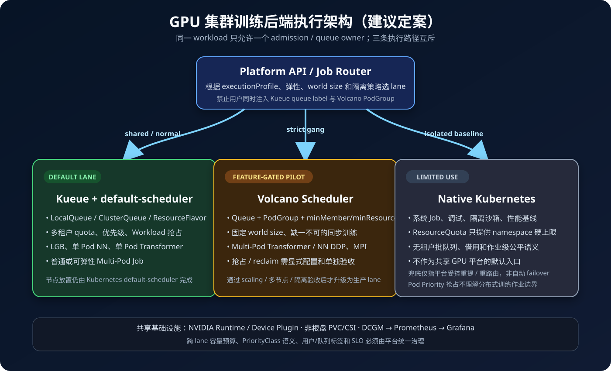

大粒度复测中，已完成场景的排队中位数均小于 `0.7s`，训练时间为数分钟。主要耗时来自训练和通信。训练代码和 NCCL 通信不属于调度后端选型范围，该结果不改变选型。

### 1.2 模型与后端的对应关系

| 模型 / 方式 | 建议后端 | Native K8s 的用途 | 何时使用 Volcano |
|---|---|---|---|
| LGB Single Pod CPU | Kueue | 隔离开发或性能基线 | 不适用 |
| LGB Single Pod GPU | 暂不开放，待 CPU/OpenCL/CUDA 后端验证 | 冒烟测试通过后可做隔离基线 | GPU 后端本身不构成 Gang 需求 |
| LGB Multi Pod | worker 数可弹性调整时使用 Kueue | 不进入共享正式环境 | worker 数固定且缺一不可时 |
| NN Single Pod | Kueue | 隔离开发或基线 | 不适用 |
| NN Multi Pod DDP | 不要求严格同时启动时使用 Kueue | 不进入共享正式环境 | 进程数固定、缺一不可时进入 Volcano Gang 试运行 |
| Transformer Single Pod | Kueue | 隔离开发或基线 | 不适用；后端选择不以模型名称为依据 |
| Transformer Multi Pod DDP | TAS/`waitForPodsReady` 通过验收后可使用 Kueue | 不进入共享正式环境 | 进程数固定、缺一不可时进入 Volcano Gang 试运行 |
| Transformer 8 GPU / 多节点 | 暂不开放 | 当前 namespace quota=4，无法执行 | 物理拓扑、NCCL、故障恢复和 N≥3 验收通过后开放 |

LGB 尚无合格的完成样本。候选内部镜像需分别验证 CPU、OpenCL `device_type=gpu` 和 CUDA `device_type=cuda`，wheel 文件名不作为后端判定依据。

### 1.3 落地方式

常规 Single-Pod 和可弹性启动的任务使用 Kueue；固定进程数并要求同时启动的分布式任务进入 Volcano 试运行；系统任务、诊断和隔离基线使用 Native Kubernetes。后端由平台执行配置确定，未开放的组合直接拒绝提交。

Kueue 配置：

- 每个研发团队或项目使用 namespaced LocalQueue。
- ClusterQueue 统一管理 GPU ResourceFlavor 以及 CPU、内存和 GPU 配额。
- 上线初期关闭 Cohort borrowing，固定各项目资源预算。
- PriorityClass/WorkloadPriorityClass 由平台统一映射，项目方不能自建超高优先级。
- 只有明确允许中断、并且有 checkpoint 策略的任务才能被抢占。
- TAS 和 `waitForPodsReady` 验收前，不开放共享环境中的 Multi-Pod 任务。

Volcano 配置：

- Queue、PodGroup 和 `schedulerName: volcano` 由平台生成，不接受任务方自由组合。
- `minMember` 设置为任务可运行的最小进程数，`minResources` 明确配置 GPU、CPU 和内存。
- preempt/reclaim 默认关闭。完成 checkpoint、可抢占任务范围和 actions 回归测试后再启用。
- 当前单节点阶段只在隔离维护窗口运行，不与 Kueue 共享同一批 GPU。
- 集群扩容后，Kueue 和 Volcano 使用互斥节点池，容量分开预算。
- 多节点开放以 NCCL 网络、节点故障和 Pod replacement 验收通过为前提。

平台约束：

- Native Kubernetes 只用于系统 Job、诊断、隔离开发环境和基线，并继续使用 ResourceQuota、PriorityClass 白名单和一致的 GPU request/limit。
- 平台 API 只暴露一个 `executionProfile`，共享 GPU 任务不能绕过队列和准入管理。
- ValidatingAdmissionPolicy/webhook 拒绝同时接入两套队列、队列类型与 `schedulerName` 不一致，以及共享 GPU Job 未接入队列的配置。
- 两套队列通道使用同一套业务优先级映射和团队、项目、队列审计字段。
- 数据、日志、checkpoint 和持久结果使用管理员确认的非根盘 PVC/CSI。

## 2. 实验安排

### 2.1 评估范围

实验分为调度功能和模型运行两组。调度功能组包含以下场景：

| 后端 | 测试内容 |
|---|---|
| Native Kubernetes | ResourceQuota 限额和资源释放后的 Job 重试 |
| Kueue | GPU/CUDA 准入、ClusterQueue 配额、整组准入、Workload 抢占 |
| Volcano | GPU/CUDA 调度、Queue capability、PodGroup/Gang、同 Queue 抢占 |

模型运行组按原始需求设置：

| 模型 | Pod 方式 | 目标资源 |
|---|---|---|
| LGB | Single Pod | CPU / 1 GPU |
| NN | Single Pod | 1 GPU |
| NN | Multi Pod | 4 GPU |
| Transformer | Single Pod | 8 GPU |
| Transformer | Multi Pod | 8 GPU |

### 2.2 实验环境

| 项目 | 实际环境 | 对评估的影响 |
|---|---|---|
| Kubernetes | k3s `v1.35.4+k3s1` | — |
| GPU 节点 | `gpu-dev-01`，1 个物理节点 | 不满足 8 节点目标，不支持多节点结论 |
| GPU | 单节点 8 × NVIDIA GeForce RTX 5090 | 总卡数为 8，不是 8 节点 × 1 卡 |
| Driver | `595.71.05` | — |
| PyTorch / CUDA | `2.13.0+cu130` / CUDA 13.0 | 容器内 CUDA 可用 |
| NCCL | `2.29.7` | 只验证同节点 world size=4 |
| Container runtime | containerd `2.2.3-k3s1` | — |
| Namespace | `gpu-dev` | 所有测试均在共享 namespace 内 |
| GPU ResourceQuota | hard=`4`，测试后 used=`0` | 8-GPU 和 8+2 GPU 并发场景未执行 |
| Kueue | `v0.19.0`，controller Ready | 评估 LocalQueue 已清理 |
| Volcano | `v1.15.1`，scheduler/controller/admission 3/3 Ready | 测试 Queue/PodGroup 已清理 |
| GPU 监控 | GPU Operator、DCGM、Prometheus、Grafana 未部署 | 正式监控链缺失 |
| 训练存储 | `local-path` PVC 与根文件系统同盘 | 不符合正式数据和 checkpoint 要求 |

集群当前只有一个 8 卡节点，Single-Pod 与 Multi-Pod 的结果仅代表单节点运行情况，不包含多节点结论。

目标拓扑会直接限制 Pod 布局。若最终采用 8 个单卡节点，`Single Pod × 8 GPU` 和 `4 Pods × 2 GPU` 均无法调度；前者要求一个 8 卡节点，后者要求四个 2 卡节点。8×1 拓扑下，Multi-Pod 配置应调整为 `8 Pods × 1 GPU`。

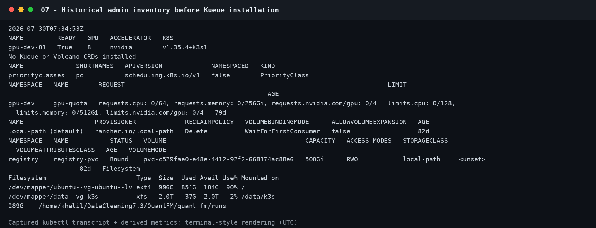

### 2.3 计时和判定口径

调度功能测试记录客户端提交、API 创建、准入、Pod 绑定、容器启动、结束和 Job 完成时间。API Job Wall Clock 取 Job `creationTimestamp` 到 `completionTime`；“提交到完成”从客户端发起请求开始。各场景的 hold/sleep 时间不同，Wall Clock 不用于调度器性能横向比较。

模型任务使用同一 digest-pinned 镜像、进程内确定性输入和固定全局工作量。`training_time` 从 warmup 结束后开始，Wall Clock 从客户端提交计至 Kubernetes Job `completionTime`。排队时间不计入 `training_time`。

模型任务使用 512Mi 内存型 `emptyDir`，不挂载 PVC/hostPath，不下载数据，不写 checkpoint。实验结果仅用于验证执行链路，不代表真实数据集训练结果。

调度生效判据如下：Kueue 需记录 Workload 配额、准入、Pod 绑定和 Job 完成；Volcano 需记录 Queue/PodGroup 状态、Pod 绑定和 Job 完成；抢占需记录低优先级任务驱逐和高优先级任务启动。

## 3. 实验过程

### 3.1 Native Kubernetes

提交请求 4 GPU 的 holder Job，占满 `gpu-dev` 的 GPU ResourceQuota；随后提交请求 1 GPU 的 waiter Job。记录 holder 运行期间 waiter 的 Pod 和 Event，以及 holder 结束后的 Job 重试和 CUDA 运行状态。

该场景只验证 ResourceQuota 和 Job controller。`FailedCreate/retry` 不计作队列能力。

### 3.2 Kueue

Kueue 使用评估专用 ResourceFlavor、ClusterQueue 和 LocalQueue。测试步骤如下：

1. GPU 准入：提交 1-GPU Job，记录 `QuotaReserved`、`Admitted`、Pod 绑定、CUDA 和 Job 状态。
2. 队列配额：ClusterQueue nominal GPU 设为 1，运行 1-GPU holder 后提交 1-GPU waiter，记录节点有空闲 GPU 时的 waiter 状态。
3. 整组准入：提交两成员、共需 2 GPU 的 Job，将 quota 从 1 调整到 2，记录 Workload 和两个 Pod 的状态变化。
4. 抢占：运行优先级 100 的 3-GPU Workload，再提交优先级 1000 的 1-GPU Workload，记录 Workload 驱逐和准入状态。

GPU Job 的预期状态链：

```text
CreatedWorkload → QuotaReserved → Admitted
→ Pod Scheduled by default-scheduler → CUDA success → Job Complete
```

未覆盖 Cohort borrowing、reclaim、Fair Sharing、Topology Aware Scheduling 和 `waitForPodsReady`。

### 3.3 Volcano

Volcano 使用评估专用 Queue 和 PodGroup。测试步骤如下：

1. GPU 调度：提交 1-GPU Job，记录调度器、Pod 绑定、CUDA 和 Job 状态。
2. 队列配额：Queue capability 设为 1，运行 1-GPU holder 后提交 1-GPU waiter，记录节点有空闲 GPU 时的 waiter 状态。
3. Gang：创建 `minMember=2/minResources=2GPU` 的 PodGroup，将 Queue capability 从 1 调整到 2，记录两个 Pod 的绑定情况。
4. 抢占：临时加入 `preempt` action，运行优先级 100 的 3-GPU 任务，再提交优先级 1000 的 1-GPU 任务，记录同 Queue 抢占过程。

抢占测试完成后，将 Volcano actions 恢复为：

```yaml
actions: "enqueue, allocate, backfill"
```

未覆盖跨 Queue reclaim、长期公平、checkpoint/resume 和多节点调度。

### 3.4 模型任务

模型任务按四卡配额内可运行的配置执行 Native Kubernetes 基线：NN Single-Pod 1 GPU、NN Multi-Pod 4 GPU、Transformer Single-Pod 1/4 GPU、Transformer Multi-Pod 4 GPU。每个场景计划运行至少 3 次，记录排队时间、训练时间和 Wall Clock。

Single-Pod 多卡和 Multi-Pod 任务保留 NCCL 日志，用于判定 Pod 内、Pod 间通信路径。LGB 在 CPU、OpenCL GPU 和 CUDA 三种后端冒烟测试通过后进入正式矩阵。

## 4. 实验结果

### 4.1 调度功能汇总

2026-07-31 完成 9 个调度功能场景。队列、配额和 Gang 测试通过。Volcano 抢占依赖临时修改 actions，记为“有条件通过”。

| 后端 | 场景 | 验证结果 | API Job Wall Clock | 提交到完成 |
|---|---|---|---:|---:|
| Native K8s | ResourceQuota | 通过：4 GPU 被占满后，waiter Pod 创建被拒；资源释放后重试成功 | `44.000s` | `44.452s` |
| Kueue | GPU/CUDA 准入 | 通过：Workload 获得配额并准入，Pod 绑定后 CUDA 运行成功 | `9.000s` | `8.934s` |
| Kueue | ClusterQueue 配额 | 通过：节点有空闲 GPU，waiter 仍按 nominal quota 等待 | `37.000s` | `37.155s` |
| Kueue | 整组准入 | 通过：quota=1 时 Pod=0；quota=2 后两成员一起准入 | `21.000s` | `21.669s` |
| Kueue | Workload 抢占 | 通过：低优先级 3-GPU Workload 被驱逐，高优先级 1-GPU Workload 启动 | `15.000s` | `15.625s` |
| Volcano | GPU/CUDA | 通过：`volcano` 完成 Pod 绑定，CUDA 运行成功 | `14.000s` | `14.200s` |
| Volcano | Queue capability | 通过：capability=1 时 waiter 未绑定；资源释放后继续运行 | `44.000s` | `44.190s` |
| Volcano | PodGroup/Gang | 通过：资源不足时 0 binding，达到 `minMember/minResources` 后 2/2 运行 | `24.000s` | `24.362s` |
| Volcano | 同 Queue 抢占 | 有条件通过：临时启用 `preempt` 后，低优先级任务被驱逐，高优先级任务启动 | `16.000s` | `16.071s` |

### 4.2 Native Kubernetes

holder 运行期间，waiter 未创建 Pod，Event 记录 5 次 `FailedCreate: exceeded quota`。holder 结束后，Job controller 重试，waiter 完成 CUDA 运算。

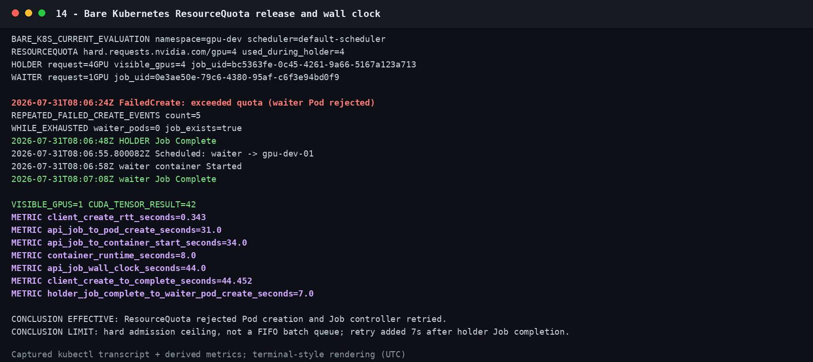

判定：ResourceQuota 限额生效。该方式不提供排队位置、FIFO、Workload 级公平或 Gang 语义；`FailedCreate/retry` 属于 Job controller 重试，不是批任务排队。

### 4.3 Kueue

1-GPU Job 状态链为 `QuotaReserved → Admitted → Scheduled → CUDA success → Complete`。Kueue 准入和 Kubernetes Pod 绑定均正常。

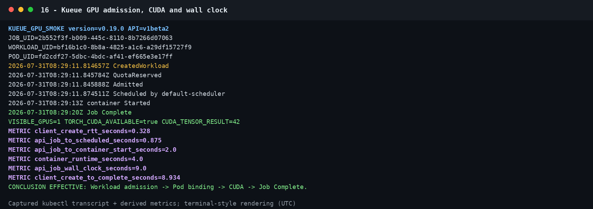

ClusterQueue nominal GPU=1。holder 占用 1 GPU 后，waiter 保持 Pending，Job 为 suspend，Pod 数为 0。节点同期有 7 GPU 空闲，等待由 ClusterQueue 配额触发。

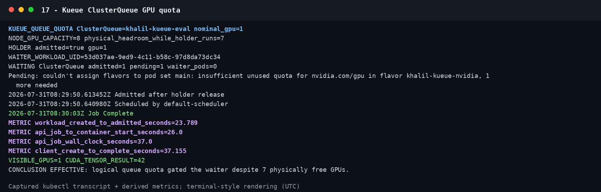

两成员 Job 共请求 2 GPU。quota=1 时 Workload 未准入，Pod 数为 0；quota 调至 2 后两个 Pod 同批准入，Scheduled spread=`0.010s`，应用启动 spread=`0.103s`。

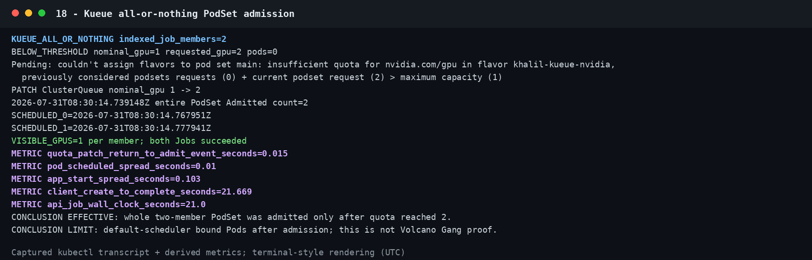

优先级 100 的 3-GPU Workload 被驱逐，优先级 1000 的 1-GPU Workload 随后准入。节点同期有 5 GPU 空闲，节点资源不足不是触发条件，本次为 Kueue 配额抢占。

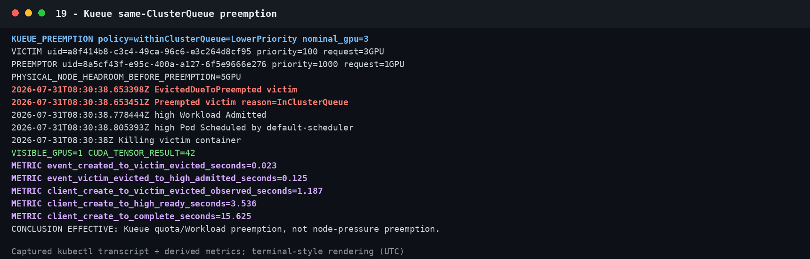

### 4.4 Volcano

Volcano v1.15.1 的 scheduler、controller 和 admission 组件均为 Ready。1-GPU Job 由 `volcano` 绑定；容器内识别到 RTX 5090，Torch CUDA 和 tensor 运算正常。

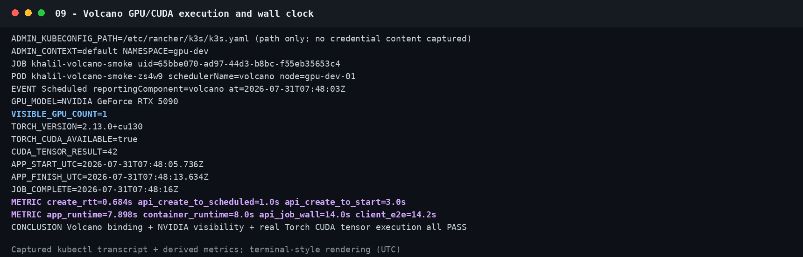

Queue capability=1。holder 占用 1 GPU 后，waiter 保持 Pending 且未绑定，节点同期有 7 GPU 空闲。holder 释放资源后，waiter 由 Volcano 绑定并完成。判定：Queue capability 生效。

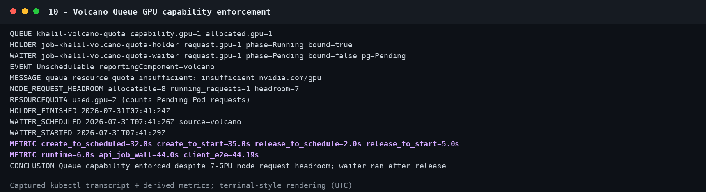

Queue capability=1 时，两个 Pod 均为 Pending，绑定数为 0；capability 调至 2 后，2/2 Pod 完成绑定，应用启动 spread=`0.099s`。判定：PodGroup `minMember/minResources` 生效。

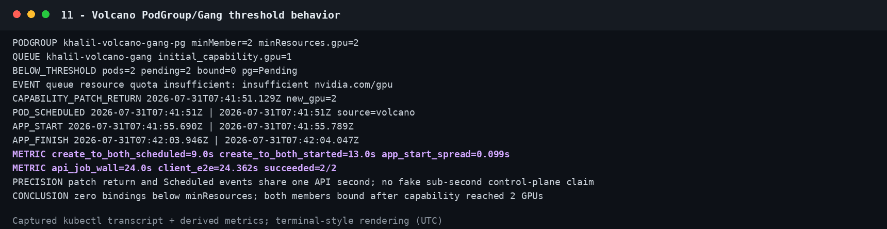

优先级 100 的 3-GPU 任务被驱逐，优先级 1000 的 1-GPU 任务随后启动并完成。该结果依赖临时启用 `preempt`；当前默认 actions 不包含抢占。

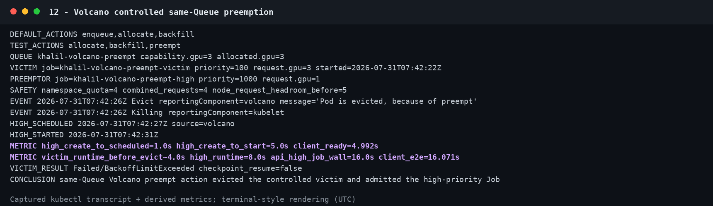

### 4.5 模型运行结果

大粒度复测完成 5 个场景，共 12 次运行：

| 场景 | N | 排队中位数 | Training 中位数 | Wall Clock 中位数 |
|---|---:|---:|---:|---:|
| NN Single Pod 1 GPU | 2 | `0.294s` | `244.949s` | `267.520s` |
| NN Multi Pod 4 GPU | 3 | `0.696s` | `140.490s` | `171.072s` |
| Transformer Single Pod 1 GPU | 3 | `0.293s` | `242.051s` | `258.107s` |
| Transformer Single Pod 4 GPU | 2 | `0.295s` | `258.674s` | `281.350s` |
| Transformer Multi Pod 4 GPU | 2 | `0.646s` | `341.705s` | `366.992s` |

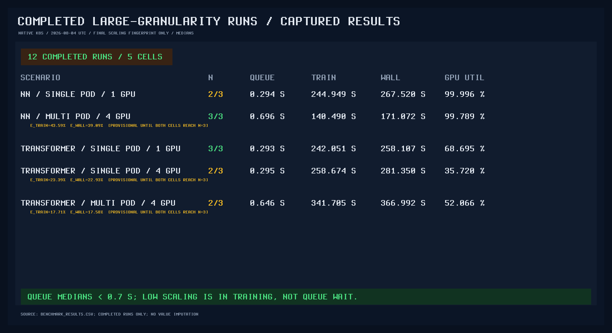

其中 3 个场景只有 2 次完成记录，数据按阶段结果使用。排队时间与训练时间相差几个数量级，本批次主要耗时不在调度准入。

Single-Pod 4 GPU 的 NCCL 路径为 `SHM/direct/direct`。Multi-Pod 日志中，Pod 内为 `SHM/direct/direct`，跨 Pod 为 `NET/Socket/0`；同时记录 `libnccl-net.so` 缺失和 `libibverbs.so[.1]` 打开失败。该批 Multi-Pod 任务使用 TCP Socket，未使用 IB/RDMA。

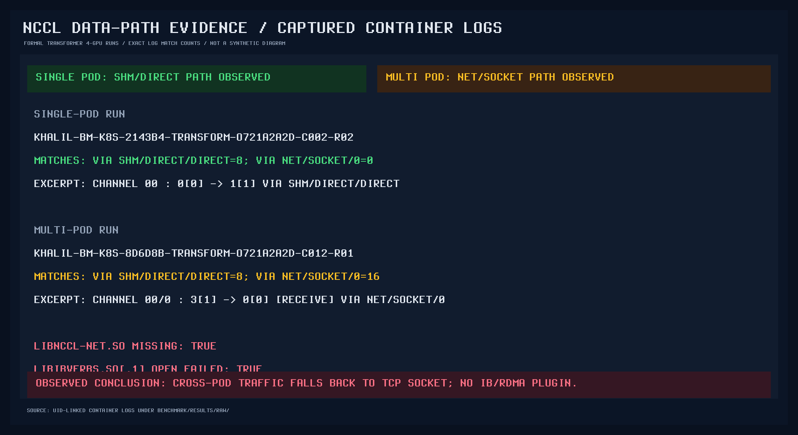

#### 完成情况

不同批次的统计口径如下。“矩阵单元完成率”表示覆盖了多少个 `scheduler × scenario` 组合，不是 Job 成功率。

| 统计范围 | 执行结果 | 说明 |
|---|---|---|
| 调度功能测试 | 9 个场景全部完成 | Native K8s、Kueue 和 Volcano 的队列、配额、Gang 和抢占均取得实际运行证据；Volcano 抢占为临时配置下的条件通过 |
| 四卡缩减矩阵 | 完成 5/15 个矩阵单元 | Native K8s 5/5；Kueue 0/5；Volcano 0/5。后两项尚未执行同模型训练，不是运行失败 |
| Native K8s 四卡缩减批次 | 15/15 次运行成功 | 5 个场景各运行 3 次，失败数为 0 |
| Native K8s 大粒度复测 | 12/18 次完成 | 其余 6 次检测到外部宿主机 GPU 进程，在创建 Job 前由安全门阻断；没有发生训练或调度失败 |

#### 未完成原因

| 模型 | Pod 方式 | 已完成内容 | 尚未完成的原因 |
|---|---|---|---|
| LGB | Single Pod | 无正式训练样本 | 内部镜像尚未分别通过 CPU、OpenCL GPU 和 CUDA 后端验证 |
| NN | Single Pod | Native K8s 四卡缩减矩阵 N=3 | Kueue 和 Volcano 的同模型训练尚未执行 |
| NN | Multi Pod | Native K8s 单节点 N=3 | Kueue 和 Volcano 的同模型训练尚未执行；无多节点结果 |
| Transformer | Single Pod | Native K8s 1 GPU 和 4 GPU 缩减场景 | 原始 8-GPU 目标超过 namespace 4-GPU 配额；Kueue 和 Volcano 的同模型训练尚未执行 |
| Transformer | Multi Pod | Native K8s 单节点 4 GPU 缩减场景 | 原始 8-GPU 目标超过 namespace 4-GPU 配额；无多节点及 Kueue/Volcano 同模型结果 |

当前缺口是实验覆盖不足，不是已有任务成功率低。现有证据支持队列、配额、抢占和 Gang 功能选型，但不支持 Kueue 与 Volcano 的训练速度对比。

### 4.6 后端能力对比

| 维度 | Native Kubernetes | Kueue v0.19 | Volcano v1.15 |
|---|---|---|---|
| 定位 | 通用 Pod-to-node 调度 | Workload 准入、队列和配额 | 独立批任务调度器 |
| 队列 | 无项目级批任务队列 | LocalQueue → ClusterQueue | Queue → PodGroup/Job |
| GPU 配额 | ResourceQuota 限制 namespace 上限 | ResourceFlavor + nominalQuota；Cohort 可借用 | Queue capability；capacity/proportion 可配份额 |
| 超额后 | Pod 创建被拒或 Pending | Workload 不准入，Job 保持 suspend | Queue/PodGroup 等待，Pod 不绑定 |
| 优先级 | Pod PriorityClass | WorkloadPriorityClass 或 Pod PriorityClass | PriorityClass + priority plugin |
| 抢占 | Pod/node 粒度，不理解整个训练 Job | Workload eviction | 同 Queue `preempt`、跨 Queue `reclaim` |
| Gang | 本集群未对 plain Job 启用 | 整组保留配额；物理就绪还依赖 TAS/`waitForPodsReady` | PodGroup `minMember`/`minResources` |
| Multi-GPU | 单 Pod 多卡需同节点容纳 | Kueue 管准入，default-scheduler 做绑定 | Volcano 管队列并直接绑定 |
| 多团队治理 | Namespace/RBAC/ResourceQuota，无批任务公平机制 | LocalQueue/ClusterQueue/Cohort/Fair Sharing | Queue/RBAC + DRF/proportion/capacity |
| 运维成本 | 低 | CRD、controller、webhook | CRD、scheduler、controller、webhook 和 actions/plugins |

Native Kubernetes 运维成本最低。ResourceQuota 只控制 namespace 上限，不管理项目排队和资源借用；Pod Priority 抢占也不识别 DDP Job 的多个成员。

Kueue 位于 Job 准入层，Pod 绑定仍由 kube-scheduler 执行。`QuotaReserved/Admitted=True` 表示 Workload 已获得逻辑配额，实际绑定以 Scheduled Event 为准。Multi-Pod 任务还需通过 TAS 和 `waitForPodsReady` 验收，避免配额满足但节点拓扑无法放置。

Volcano 直接参与 Pod 绑定，PodGroup `minMember/minResources` 用于固定规模同步训练。其运维范围包括 Queue、actions 和 plugins，这些配置直接影响入队和抢占。Volcano 处理资源准入和启动时序，不改变训练计算性能。

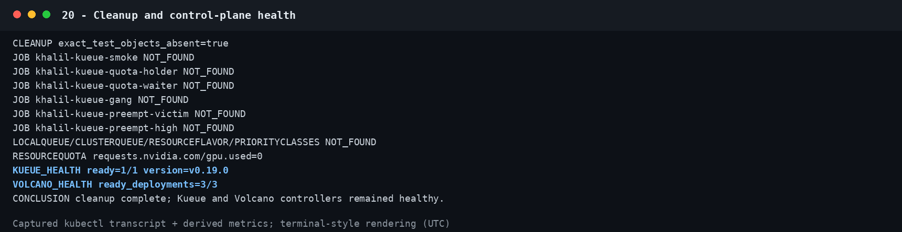

## 5. 后续工作

1. 使用同一镜像、参数和数据，补齐 Kueue/Volcano 的 NN 和 Transformer Single/Multi-Pod N≥3 运行，同时记录 training time 和 Wall Clock。
2. 分别验证 LGB 的 CPU、OpenCL GPU 和 CUDA 后端，然后补齐三种后端的运行结果。
3. 确定 8-GPU/多节点物理拓扑和 Pod 布局，再做真实 NCCL/DDP 测试。
4. 并发提交不同项目的 Transformer、NN 和 LGB 任务，检查长期排队、队列顺序、配额释放和公平性。
5. 完成 Kueue TAS、`waitForPodsReady`、Fair Sharing 和受控抢占测试。
6. 按最终 actions 回归 Volcano Gang、Queue 和 preempt/reclaim。
7. 补齐 Pod/Node 故障、重试、checkpoint/resume 和抢占后恢复。
8. 部署 GPU Operator/DCGM Exporter/Prometheus/Grafana，按 Job、团队和队列关联监控数据。
9. 替换根盘 `local-path` PVC，再验证数据吞吐、checkpoint 持久性、存储配额和故障恢复。
