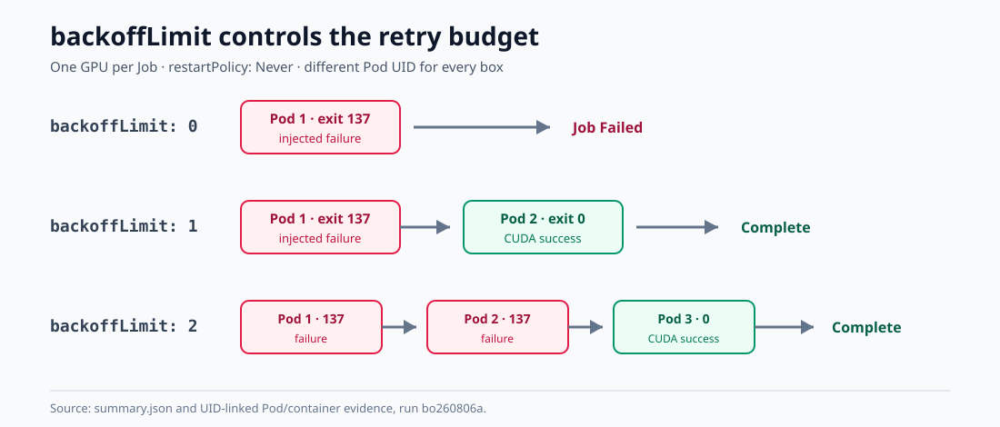
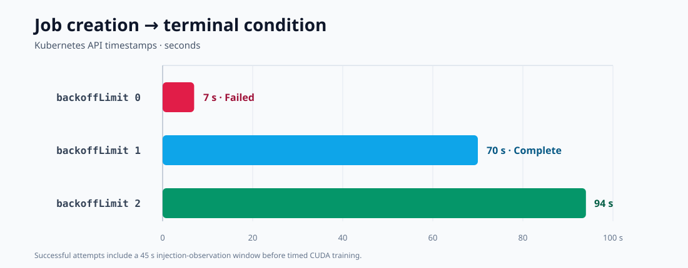

# Kubernetes Job `backoffLimit` 0/1/2 对照实验

## 1. 结论

三组结果与 Job 的重试预算一致。

- `backoffLimit: 0`：首个 Pod 退出 137 后不再创建 Pod，Job 以
  `BackoffLimitExceeded` 结束。
- `backoffLimit: 1`：首个 Pod 退出 137，第二个 Pod 完成 CUDA 训练，Job
  Complete。
- `backoffLimit: 2`：前两个 Pod 均退出 137，第三个 Pod 完成 CUDA 训练，Job
  Complete。

每次重试都创建了新的 Pod UID。三组任务结束后，Job 和 Pod 均已删除，GPU、CPU
和内存配额回到 0，主机上没有遗留的 GPU 计算进程。

本轮只检查 Kubernetes Job controller 的重试次数和终态，不涉及 checkpoint、
节点故障或抢占恢复。

## 2. 实验设计

三组使用相同镜像、训练代码、GPU 数量和故障注入方式，只调整 `backoffLimit` 和
故障注入次数。

| 项目 | 配置 |
|---|---|
| Namespace | `gpu-dev` |
| 调度器 | `default-scheduler` |
| GPU | 每个 Job 1 × NVIDIA RTX 5090，三组串行 |
| 镜像 | `registry.zs/gpu-dev/dylan-trainer@sha256:9e7f7f8dc3c15c522408d1e8da38401ac224b99ddfba363078f40403eb456574` |
| 训练 | MLP，warm-up 10 步，计时 80 步，batch 4096，BF16 |
| Pod 策略 | `restartPolicy: Never` |
| 临时存储 | 512Mi 内存型 `emptyDir`；无 PVC/hostPath |
| Job 限时 | `activeDeadlineSeconds: 300` |

| 组别 | 注入故障 | 预期 Pod 数 | 预期 Job 终态 |
|---|---:|---:|---|
| `backoffLimit: 0` | 1 次 | 1 | Failed / `BackoffLimitExceeded` |
| `backoffLimit: 1` | 1 次 | 2 | Complete |
| `backoffLimit: 2` | 2 次 | 3 | Complete |

每个 Pod 输出 `attempt_started` 后，由客户端在容器内终止训练 Python 子进程。
被终止的容器应以非零退出码结束；未注入故障的最后一次尝试必须输出唯一 CUDA
训练结果并以退出码 0 结束。

每组提交前分别检查权限、ResourceQuota、正在运行的 GPU Pod 和主机 GPU 计算
进程，并执行 server-side dry-run。Job 删除时同时核对名称和 UID。

## 3. 实验结果

| `backoffLimit` | Pod 退出码 | Job 终态 | API Wall Clock | CUDA Training Time |
|---:|---|---|---:|---:|
| 0 | `137` | Failed / `BackoffLimitExceeded` | 7 秒 | 无 |
| 1 | `137 → 0` | Complete | 70 秒 | 0.279724 秒 |
| 2 | `137 → 137 → 0` | Complete | 94 秒 | 0.280307 秒 |

图 1：`backoffLimit` 决定失败后最多能够创建多少个重试 Pod。每个方框代表一个
不同 UID 的 Pod。

图 2：Kubernetes API 记录的 Job 创建至终态时间。成功组包含 45 秒故障注入观察
窗口，因此该 Wall Clock 不能与纯训练时间直接比较。

### 3.1 `backoffLimit: 0`

Job `khalil-pod-retry-bo260806ab0` 只创建了一个 Pod。故障注入后容器退出 137，
Job 在约 3.152 秒后进入 Failed，终态原因为 `BackoffLimitExceeded`。本组没有
训练成功标记。

### 3.2 `backoffLimit: 1`

第一个 Pod 退出 137 后，Job controller 用 13.850 秒创建并启动第二个 Pod。
第二个 Pod 的 UID 不同，以退出码 0 完成 80 步 CUDA 训练。Job API Wall Clock
为 70 秒。

### 3.3 `backoffLimit: 2`

第一次故障到第二个 Pod 进入实验窗口用时 13.852 秒；第二次故障到第三个 Pod
进入实验窗口用时 22.429 秒。第三个 Pod 以退出码 0 完成训练，Job API Wall
Clock 为 94 秒。

### 3.4 清理

三组均在验证后按 Job 名称和 UID 删除。最终复核时间为
`2026-08-06T08:57:25Z`：实验 Job 数 0、实验 Pod 数 0、ResourceQuota 的 CPU、
内存和 GPU used 均为 0，主机 GPU 计算进程数为 0。

## 4. 原始记录

- [矩阵摘要](../../../benchmark/results/reliability/backoff-matrix-bo260806a/summary.json)
- [`backoffLimit: 0` 结果](../../../benchmark/results/reliability/backoff-matrix-bo260806a/backoff-0/result.json)
- [`backoffLimit: 1` 结果](../../../benchmark/results/reliability/backoff-matrix-bo260806a/backoff-1/result.json)
- [`backoffLimit: 2` 结果](../../../benchmark/results/reliability/backoff-matrix-bo260806a/backoff-2/result.json)
- [`backoffLimit: 0` 时间线](../../../benchmark/results/reliability/backoff-matrix-bo260806a/backoff-0/timeline.tsv)
- [`backoffLimit: 1` 时间线](../../../benchmark/results/reliability/backoff-matrix-bo260806a/backoff-1/timeline.tsv)
- [`backoffLimit: 2` 时间线](../../../benchmark/results/reliability/backoff-matrix-bo260806a/backoff-2/timeline.tsv)
- [清理后复核](../../../benchmark/results/reliability/backoff-matrix-bo260806a/post-cleanup-verification.json)
- [三组重试结果原图](images/backoff-outcomes.svg)
- [Job Wall Clock 原图](images/backoff-wall-clock.svg)
