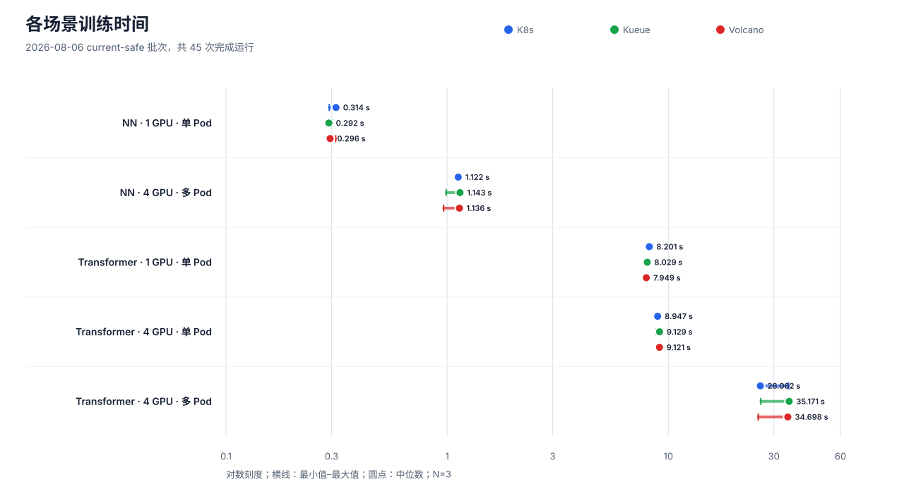
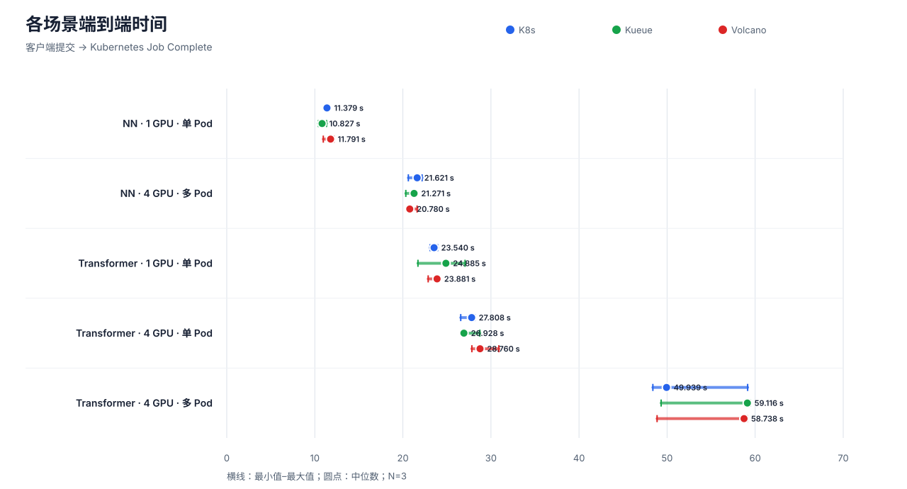
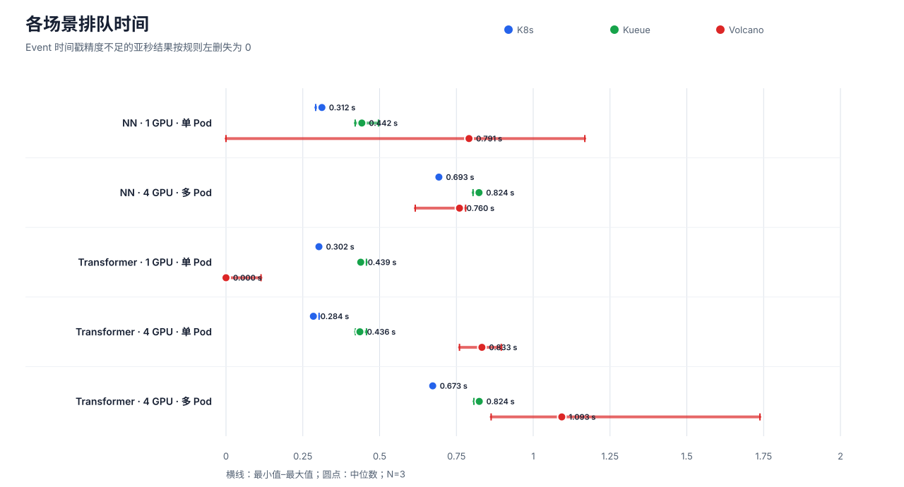
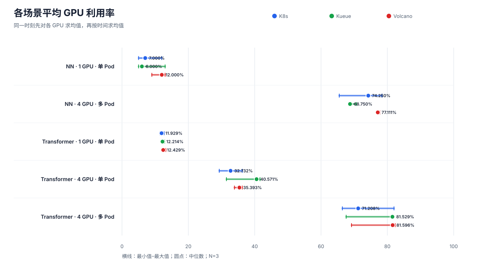

# NN 与 Transformer 三调度器对比实验（2026-08-06）

## 1. 结论

本次实验共设置 5 个场景，分别在 Native Kubernetes、Kueue 和 Volcano 上
重复运行 3 次，45/45 次运行完成。各调度器使用同一镜像、同一组参数和
相同的确定性合成数据。

主要结果如下：

- NN 单卡训练时间中位数为 0.292–0.314 秒；Transformer 单卡为
  7.949–8.201 秒；Transformer 单 Pod 四卡为 8.947–9.129 秒。
- NN 多 Pod 四卡训练时间中位数为 1.122–1.143 秒。Transformer 多 Pod
  四卡为 26.062–35.171 秒，三次重复的离散程度高于其他场景。

## 2. 实验设计

### 2.1 对比原则

实验只改变调度器和 Pod 布局。模型结构、固定工作量、镜像、运行参数和数据
生成方式保持不变。每个“场景 × 调度器”组合运行 3 次，执行顺序使用种子
`20260806` 随机打散，以减少运行先后顺序的影响。

三个调度路径分别为：

- Native Kubernetes：直接使用 `default-scheduler`。
- Kueue：由实验 LocalQueue/ClusterQueue 完成准入，再交给默认调度器。
- Volcano：使用实验 Queue 和 PodGroup，由 Volcano Scheduler 调度。

### 2.2 运行环境

| 项目 | 配置 |
|---|---|
| Namespace | `gpu-dev` |
| 单次任务最大 GPU 数 | 4 |
| 镜像 | `registry.zs/gpu-dev/dylan-trainer@sha256:9e7f7f8dc3c15c522408d1e8da38401ac224b99ddfba363078f40403eb456574` |
| 输入数据 | 进程内确定性合成数据 |
| 临时存储 | 512Mi 内存型 `emptyDir` |
| 持久存储 | 未挂载 PVC 或 hostPath |
| Matrix SHA-256 | `eb9f41067008490d3894dfa619f759f5e086d08df5bc24f5d6f0a8f3506d70df` |
| Runtime SHA-256 | `7b3d662d2f84f2373e4a2e6d71932b83856840cc58c68b01c2e7a00534071e6b` |

### 2.3 实验矩阵

| 场景 | Pod × GPU/Pod | CPU / 内存（每 Pod） | 模型结构 | 固定工作量 |
|---|---:|---:|---|---|
| NN · 1 GPU · 单 Pod | 1 × 1 | 8 / 16Gi | features=100; layers=[1024, 1024, 512] | global batch=4096; steps=80; warmup=10 |
| NN · 4 GPU · 多 Pod | 4 × 1 | 2 / 4Gi | features=100; layers=[1024, 1024, 512] | global batch=4096; steps=80; warmup=10 |
| Transformer · 1 GPU · 单 Pod | 1 × 1 | 4 / 12Gi | L=12; H=768; heads=12; seq=64 | effective batch=64; steps=20; warmup=2 |
| Transformer · 4 GPU · 单 Pod | 1 × 4 | 4 / 12Gi | L=12; H=768; heads=12; seq=64 | effective batch=64; steps=20; warmup=2 |
| Transformer · 4 GPU · 多 Pod | 2 × 2 | 2 / 6Gi | L=12; H=768; heads=12; seq=64 | effective batch=64; steps=20; warmup=2 |

### 2.4 指标定义

- **训练时间（Training Time）：** 训练程序记录的全局训练区间。多 Pod 运行需
  各 rank 的结构化记录一致。
- **端到端时间（Wall Clock）：** 从客户端提交到 Kubernetes Job Complete。
- **排队时间（Queue Time）：** 从提交到最后一个预期 Pod 完成调度或准入。
- **GPU 利用率：** 同一采样时刻先对各 GPU 求平均，再按时间求平均。

完成记录必须同时具备 Job/Pod UID、Event、容器训练记录、GPU 样本、配额恢复
和清理结果。dry-run 和 readiness 记录不计入 45 次正式运行。

## 3. 实验结果

### 3.1 中位数汇总

| 场景 | 调度器 | N | 训练时间 s | 端到端时间 s | 排队时间 s | GPU 利用率 % |
|---|---|---:|---:|---:|---:|---:|
| NN · 1 GPU · 单 Pod | K8s | 3 | 0.314301 | 11.379 | 0.312151 | 7.000 |
| NN · 1 GPU · 单 Pod | Kueue | 3 | 0.291717 | 10.827 | 0.442177 | 6.000 |
| NN · 1 GPU · 单 Pod | Volcano | 3 | 0.295610 | 11.791 | 0.791000 | 12.000 |
| NN · 4 GPU · 多 Pod | K8s | 3 | 1.122089 | 21.621 | 0.692917 | 74.250 |
| NN · 4 GPU · 多 Pod | Kueue | 3 | 1.142873 | 21.271 | 0.823537 | 68.750 |
| NN · 4 GPU · 多 Pod | Volcano | 3 | 1.136167 | 20.780 | 0.760000 | 77.111 |
| Transformer · 1 GPU · 单 Pod | K8s | 3 | 8.201485 | 23.540 | 0.302469 | 11.929 |
| Transformer · 1 GPU · 单 Pod | Kueue | 3 | 8.029038 | 24.885 | 0.438548 | 12.214 |
| Transformer · 1 GPU · 单 Pod | Volcano | 3 | 7.948987 | 23.881 | 0.000000 | 12.429 |
| Transformer · 4 GPU · 单 Pod | K8s | 3 | 8.946993 | 27.808 | 0.284381 | 32.732 |
| Transformer · 4 GPU · 单 Pod | Kueue | 3 | 9.128663 | 26.928 | 0.435902 | 40.571 |
| Transformer · 4 GPU · 单 Pod | Volcano | 3 | 9.120512 | 28.760 | 0.833000 | 35.393 |
| Transformer · 4 GPU · 多 Pod | K8s | 3 | 26.062220 | 49.939 | 0.672835 | 71.208 |
| Transformer · 4 GPU · 多 Pod | Kueue | 3 | 35.170762 | 59.116 | 0.824342 | 81.529 |
| Transformer · 4 GPU · 多 Pod | Volcano | 3 | 34.698093 | 58.738 | 1.093000 | 81.596 |

表中数值为三次运行的中位数。最小值、中位数和最大值可在
[CSV 数据](current-safe-20260806-results.csv) 和
[JSON 数据](current-safe-20260806-results.json) 中查询。

### 3.2 训练时间

横线表示三次运行的最小值和最大值，圆点表示中位数。由于 NN 和
Transformer 的训练时间相差较大，横轴采用对数刻度。

单 Pod 场景中，调度器之间的训练时间差异较小。Transformer 多 Pod 四卡场景
在三种调度器下都出现了约 26 秒和约 35 秒两组结果，需要通过更长训练和更多
重复次数进一步确认原因。

### 3.3 端到端时间

所有场景的端到端时间都明显高于训练时间。短任务中，容器和分布式进程的启动
成本会显著影响总耗时。

### 3.4 排队时间

### 3.5 GPU 利用率

多 Pod 场景的 GPU 利用率高于短时单卡场景。由于任务持续时间短，这些数值
主要用于核对本批次运行，不作为长时稳态训练的利用率估计。
