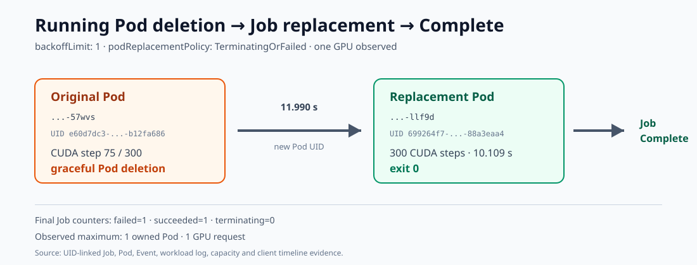
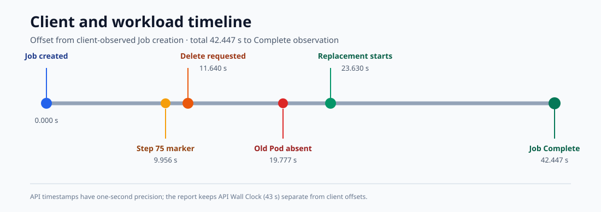

# 运行中删除 Pod 与 Kubernetes Job 补建实验

## 1. 结论

`podReplacementPolicy: TerminatingOrFailed` 组通过。

首个 Pod 在 CUDA 训练第 75/300 步被优雅删除。Job controller 随后创建了 UID
不同的替代 Pod；替代 Pod 从头完成 300 步训练并以退出码 0 结束，Job 最终
Complete。

从发出删除请求到替代 Pod 输出启动标记用时 11.990 秒；旧 Pod 确认消失后，
再用 3.853 秒看到替代 Pod。Job API Wall Clock 为 43 秒。

过渡期间观测到的最大自有 Pod 数为 1，ResourceQuota 中最大 GPU request 也为
1，没有出现两个 GPU Pod 并行占用资源。最终 Job 状态为 `failed=1`、
`succeeded=1`、`terminating=0`。

此前使用 `podReplacementPolicy: Failed` 的调试组在 150 秒观察期内没有创建替代
Pod，已按失败处理并清理。该组不计入通过结果。

本实验验证的是 Pod 删除后的 Job 补建和从头重跑，不是 checkpoint/resume。

## 2. 实验设计

### 2.1 运行配置

| 项目 | 配置 |
|---|---|
| Job | `khalil-pod-delete-del260806c` |
| Namespace | `gpu-dev` |
| 调度器 | `default-scheduler` |
| GPU | 1 × NVIDIA RTX 5090 |
| 镜像 | `registry.zs/gpu-dev/dylan-trainer@sha256:9e7f7f8dc3c15c522408d1e8da38401ac224b99ddfba363078f40403eb456574` |
| Job 策略 | `backoffLimit: 1`，`podReplacementPolicy: TerminatingOrFailed` |
| Pod 策略 | `restartPolicy: Never`，`parallelism: 1`，`completions: 1` |
| 训练 | MLP，warm-up 10 步，正式训练 300 步，batch 4096，BF16 |
| 删除位置 | 第 75 步，即总步数的 25% |
| 临时存储 | 512Mi 内存型 `emptyDir`；无 PVC/hostPath |
| 截止时间 | 240 秒 |

训练每 75 步输出一次结构化进度。第 75 步的标记同时包含 Pod UID；客户端只有在
日志 UID、实时 Pod UID、run token 和 ownerReference Job UID 全部一致时，才按
精确 Pod 名称发出普通删除请求。删除命令不使用 `--force`、`--now` 或零宽限期。

### 2.2 验收条件

1. 首个 Pod 在第 75 步仍为 Running，且 UID 与训练日志一致。
2. 删除前再次核对 Pod UID、run token 和 Job owner UID。
3. 首个 Pod 最终不存在；替代 Pod 的 UID 与首个 Pod 不同。
4. 替代 Pod 输出唯一 CUDA 成功结果并以退出码 0 结束。
5. Job `Complete=True`、`succeeded=1`、`active=0`、`terminating=0`。
6. 过渡期自有 Pod 和 GPU request 均不超过 2，并记录实际最大值。
7. 清理后实验 Job/Pod 不存在，CPU、内存和 GPU 配额回到 0。

## 3. 实验结果

| 指标 | 结果 |
|---|---:|
| 删除位置 | 75 / 300 步 |
| 删除请求至替代 Pod 启动 | 11.990 秒 |
| 旧 Pod 消失至替代 Pod 启动 | 3.853 秒 |
| Job API Wall Clock | 43 秒 |
| 替代 Pod Training Time | 10.109259 秒 |
| 其中 CUDA step time | 1.085312 秒 |
| 首个 Pod UID | `e60d7dc3-f111-4def-8c44-11e3b12fa686` |
| 替代 Pod UID | `699264f7-3749-4507-856f-71a988a3eaa4` |
| 替代 Pod 退出码 | 0 |
| Job 最终计数 | `failed=1`，`succeeded=1`，`terminating=0` |
| 最大自有 Pod 数 | 1 |
| 最大 GPU request | 1 |
| 捕获的关联 Event | 12 |

图 1：首个 Pod 在训练进行到 25% 时被删除，Job controller 创建替代 Pod，后者
重新执行完整训练并使 Job Complete。

图 2：客户端和训练日志记录的关键时间点。图中时间以 Job 创建为 0 秒。

### 3.1 Pod 与 Job 状态

首个 Pod `khalil-pod-delete-del260806c-57wvs` 在删除前为 Running，日志已记录
第 75 步。删除后该 Pod 对象消失。替代 Pod
`khalil-pod-delete-del260806c-llf9d` 使用不同 UID，完成 300 步训练并输出唯一
成功记录。

Events 中包含两个 Pod 各自的 Scheduled、Pulled、Created 和 Started，以及首个
Pod 的 Killing、Job 的两次 SuccessfulCreate 和最终 Completed。最终 Job 保留
一次 failed 和一次 succeeded 计数。

### 3.2 资源占用

替代阶段共记录 9 次容量快照，只出现 `(Pod 数, GPU request) = (1,1)`、`(1,0)`
和 `(0,0)`，未观察到两个 Pod 或两个 GPU request 并存。

### 3.3 `Failed` 策略调试组

调试运行 `del260806b` 使用 `podReplacementPolicy: Failed`。首个 Pod 删除后，
自有 Pod 列表持续为空，150 秒内没有出现替代 Pod，执行器超时退出。该运行随后
完成精确清理，GPU request 回到 0。由于该版执行器未在超时前保存最终 Job 和
Events，因此这里只陈述“观察期内未补建”，不进一步推断 Job controller 的最终
处理结果。

## 4. 原始记录

- [通过结果](../../../benchmark/results/reliability/pod-deletion-del260806c/result.json)
- [时间线](../../../benchmark/results/reliability/pod-deletion-del260806c/timeline.tsv)
- [最终 Job](../../../benchmark/results/reliability/pod-deletion-del260806c/job-final.json)
- [最终 Pod](../../../benchmark/results/reliability/pod-deletion-del260806c/pods-final.json)
- [关联 Events](../../../benchmark/results/reliability/pod-deletion-del260806c/events.json)
- [替代阶段容量快照](../../../benchmark/results/reliability/pod-deletion-del260806c/replacement-capacity-observations.json)
- [首个 Pod 删除前快照](../../../benchmark/results/reliability/pod-deletion-del260806c/first-pod-before-deletion.json)
- [替代 Pod 日志](../../../benchmark/results/reliability/pod-deletion-del260806c/container-khalil-pod-delete-del260806c-llf9d.txt)
- [清理后复核](../../../benchmark/results/reliability/pod-deletion-del260806c/post-cleanup-verification.json)
- [`Failed` 策略调试结果](../../../benchmark/results/reliability/pod-deletion-del260806b/failure.json)
- [`Failed` 策略调试时间线](../../../benchmark/results/reliability/pod-deletion-del260806b/timeline.tsv)
- [Pod 删除与补建链原图](images/pod-deletion-lifecycle.svg)
- [实验时间线原图](images/pod-deletion-timeline.svg)
