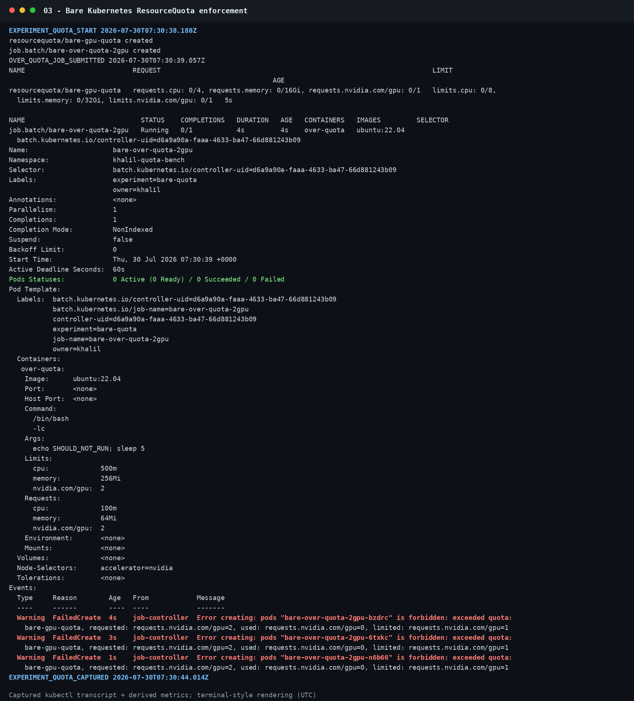
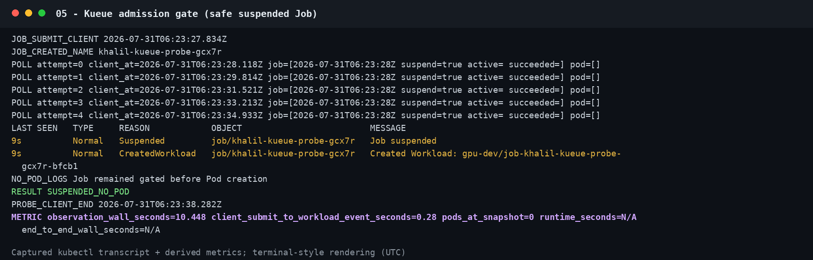
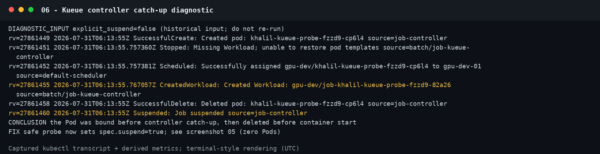

# GPU 调度评估：Kueue / Volcano / 裸 Kubernetes

> 本文件是早期阶段性调研。最新功能实测、模型 N=3 数据和最终架构决策请见 [GPU 集群训练后端执行选型评估报告](../GPU集群训练后端执行选型评估报告.md)。

> 核验日期：2026-07-31 UTC  
> 目标集群：k3s `v1.35.4+k3s1`，`gpu-dev`  
> 证据范围：裸 Kubernetes 历史单次实测 + 当前 Kueue 控制面探针 + Volcano 现网缺失核验 + 官方能力研究。

## 1. 结论

1. **裸 Kubernetes 的 GPU 资源约束、ResourceQuota 和 Pod Priority 抢占均有实际生效证据。** 历史隔离实验中，5 GPU waiter 因 `Insufficient nvidia.com/gpu` 等待，API 对象口径约为排队 `34s`、运行 `10s`、Job 端到端 `46s`；高优先级 Pod 约 `2s` 启动并触发低优先级 Pod 的 `Preempted` 事件。
2. **裸 Kubernetes 没有面向批作业的显式队列。** ResourceQuota 是硬上限，不提供 LocalQueue、队列排序、份额借用、公平分享或作业级抢占。永久超限 Job 会反复 `FailedCreate`，而不是形成一个可观测、可排序的批作业队列。
3. **当前集群已经安装并运行 Kueue Job Controller，不再是“未安装”。** `kueue.x-k8s.io/v1beta2` API 已存在；实际探针产生 `CreatedWorkload`，Job 保持 `suspend=true`，约 `10.45s` 观察窗内 Pod 数始终为 0。Kueue 的“准入前门控”实际生效。
4. **Kueue 端到端 GPU 调度尚未验证成功。** 测试使用候选队列名 `gpu-dev`，但观察期间没有 Admission、Pod 或容器启动。当前账号又不能读取 LocalQueue、ClusterQueue、Workload 和 ResourceQuota，无法区分“队列名不存在、队列未激活、无 quota 或其他 AdmissionCheck”。这 `10.45s` 是右删失下界，不能当作完整 queue wait 或 Job wall-clock。
5. **当前 Kueue 路径存在一个需管理员检查的接管时序风险。** 首次诊断未显式设置 `spec.suspend:true`，Pod 已被 `default-scheduler` 绑定后才被 Kueue Controller 删除。安全探针改成显式挂起后，验证为 0 Pod。正式使用前应检查 mutating webhook/Job integration；客户端暂时保留显式 `suspend:true`。
6. **Volcano 当前未安装。** 现网 API Discovery 没有 `scheduling.volcano.sh` 资源；受限账号也无权安装 CRD、scheduler、controller、webhook、RBAC。因而本文只陈述 Volcano 官方能力和限制，不能声称其配额、Gang、抢占或 wall-clock 已在本集群生效。
7. **当前优先补齐 Kueue，而不是立即引入 Volcano。** QuantFM 主要是原生 `batch/v1 Job`，Kueue 已在集群出现，迁移和运维面更小。只有在明确转向多节点、多 Pod 分布式训练并强依赖 Gang 时，Volcano 的收益才可能超过其独立调度器复杂度。

一句话状态：**裸 K8s 三项基础行为已完成单次实测；Kueue 只证明了 gate/Workload 创建，尚未证明可运行队列和 GPU Admission；Volcano 未安装、未实测。**

## 2. 证据等级与现网状态

| 项目 | 当前证据 | 能否写“实际生效” |
|---|---|---|
| 裸 K8s GPU 独占/资源不足等待 | 5+5 GPU 历史实测，`FailedScheduling: Insufficient nvidia.com/gpu`，容器内 `VISIBLE_GPUS 5` | 是，单次实测 |
| 裸 K8s ResourceQuota | quota=1、Job 请求=2、0 Pod、三次 `FailedCreate` | 是，硬上限生效 |
| 裸 K8s Pod Priority 抢占 | victim `Preempted/Killing`，preemptor 运行 | 是，Pod 级抢占生效 |
| Kueue Controller / Job gate | 当前 Job `Suspended`、`CreatedWorkload`、0 Pod | 是，控制面 gate 生效 |
| Kueue GPU quota / borrowing / fair sharing / preemption | 无可读 Queue/Workload 条件，也无成功 Admission | 否 |
| Kueue Admission 后实际 GPU 可用 | 无 Running Pod、无 `nvidia-smi`/CUDA 输出 | 否 |
| Volcano | API 不存在 | 否 |
| 稳定性能、median/P95 | 每个历史场景仅一次 | 否 |

当前受限账号盘点截图如下。它同时证明 Kueue API 存在、Volcano API 为空，以及账号只能创建 Job，不能读取 Kueue 队列/Workload 或 ResourceQuota：


补充边界：2026-07-30 的管理员快照显示单节点 `gpu-dev-01`、8 GPU；当前受限账号不能 `get nodes`，所以本文不把该容量误写为 2026-07-31 的重新核验值。handout 声明 `gpu-dev` 共享上限为 4 GPU，但当前账号不能直接读取 ResourceQuota。

## 3. 三种方案的能力和限制

| 维度 | 裸 Kubernetes | Kueue | Volcano |
|---|---|---|---|
| 定位 | 通用 Pod 调度 | Job 准入、队列与逻辑配额 | 独立批处理调度器 |
| 调度链路 | Job → Pod → `default-scheduler` | Job → Workload/Queue Admission → `default-scheduler` | Job/PodGroup → `volcano-scheduler` |
| 用户队列 | 无；只有 scheduler 内部 pending queue | LocalQueue → ClusterQueue | Queue |
| GPU 配额 | ResourceQuota 硬上限 | ResourceFlavor + `nominalQuota` | `capability` / `deserved` / `guarantee` |
| 超额行为 | API/Job Controller 拒绝创建 Pod，或 Pod 因节点资源 Pending | Workload 保持未准入，Job 挂起且通常不创建 Pod | PodGroup/Job 在 Queue 中等待 |
| 队列间借用 | 无 | Cohort、borrowing/lending limits | deserved 借用 + reclaim |
| 公平分享 | 无批作业公平策略 | ClusterQueue Fair Sharing；可选 LocalQueue Admission Fair Sharing | capacity/proportion 等插件 |
| 抢占 | Pod Priority；粒度是 Pod | Workload 级，同队列或 Cohort；默认策略需显式配置 | 同 Queue `preempt`，跨 Queue `reclaim`；action/plugin 必须启用 |
| Gang | 当前未证明启用 K8s 1.35 Alpha 能力 | 整体 quota admission；严格物理放置还需 TAS / `waitForPodsReady` | PodGroup/`minAvailable` 是核心能力 |
| Backfill | 无批作业级 backfill | BestEffortFIFO 可跳过暂时放不下的大 Workload | 官方 `backfill` action 针对无 request 的 BestEffort Pod，不等同于 GPU 小作业填洞 |
| 原生 `batch/v1 Job` | 原生 | 内置集成，通常只加 queue label | 可调度；高级多 Task/lifecycle 常使用 VolcanoJob |
| 运维面 | 最小 | CRD + controller + webhook | CRD + scheduler + controller + webhook + scheduler ConfigMap |
| 当前现网状态 | 正在使用 | API/Controller 已出现，但可运行 Queue 未证实 | 未安装 |

### 3.1 裸 Kubernetes

ResourceQuota 与队列不是同一件事：

- ResourceQuota 只回答“这个 Pod 创建后是否超过 namespace hard limit”；
- `default-scheduler` 只回答“当前节点能不能放下这个 Pod”；
- 两者都不表达团队 A/B 的 nominal share、借用、长期公平、计划开始时间或作业级抢占。

Pod Priority 抢占也不理解训练作业语义。victim Pod 被终止后 CUDA 上下文消失；checkpoint/resume、重试整个分布式作业以及浪费算力的统计都要由应用和 Job 控制器承担。

### 3.2 Kueue

Kueue 不替换 `kube-scheduler`。它先对 Workload 做逻辑配额准入，准入后才解除 Job 挂起，节点选择仍由默认调度器完成。[Kueue Overview](https://kueue.sigs.k8s.io/docs/overview/)

对 GPU 最有价值的能力是：

- LocalQueue 是 namespace 内入口，ClusterQueue 定义跨 namespace 的配额和排序；
- `nominalQuota` 是队列的逻辑额度，同一 Cohort 可按 borrowing/lending policy 借用空闲额度；
- Fair Sharing 可以按队列 share 控制 Admission/抢占顺序；
- Workload Priority 和 preemption 可以整作业挂起/驱逐，而不是只看单个 Pod。

但有两个关键限制：

1. `Admitted=True` 只证明逻辑配额通过，不证明节点能放下。官方给出的典型反例是：总计 8 GPU 分散在两台各 4 GPU 的节点，单 Pod 请求 8 GPU；无 TAS 时 Kueue 可能准入，但默认调度器永远放不下。[Topology Aware Scheduling](https://kueue.sigs.k8s.io/v0.19/docs/concepts/topology_aware_scheduling/)
2. Kueue 的 all-or-nothing 主要是 PodSets 的整体 quota reservation，不等同于 kube-scheduler 原子 Gang transaction。严格多 Pod 启动还要结合 TAS、`waitForPodsReady`、超时和 requeue。[All-or-nothing](https://kueue.sigs.k8s.io/docs/concepts/all_or_nothing/)

官方能力细节见 [ClusterQueue](https://kueue.sigs.k8s.io/v0.19/docs/concepts/cluster_queue/)、[LocalQueue](https://kueue.sigs.k8s.io/v0.19/docs/concepts/local_queue/)、[Preemption](https://kueue.sigs.k8s.io/v0.19/docs/concepts/preemption/) 和 [Admission Fair Sharing](https://kueue.sigs.k8s.io/docs/concepts/admission_fair_sharing/)。

### 3.3 Volcano

Volcano 的 Queue 资源字段不是同义词：

- `capability`：硬上限；
- `deserved`：可借可还的软权益，capacity 插件使用；
- `guarantee.resource`：不可共享的保留量，隔离更强但可能造成 GPU 闲置；
- `weight`：proportion 插件用于动态计算队列份额。

固定 GPU 池更适合 capacity；弹性节点池可考虑 proportion。`preempt` 是同 Queue 内抢占，`reclaim` 是跨 Queue 回收借用资源，两者只有出现在实际 scheduler action pipeline 且 victim 被驱逐时才能写“生效”。[Queue Resource Management](https://volcano.sh/docs/keyfeatures/queueresourcemanagement/)、[Scheduling Actions](https://volcano.sh/docs/scheduler/actions/)

Volcano 的核心优势是 PodGroup/Gang：资源不足 `minAvailable` 时整组不应放行。但 Gang 保证的是调度门槛，不保证所有容器同一时刻开始；镜像拉取、init、PVC 挂载仍会造成 startedAt 偏差。[PodGroup](https://volcano.sh/docs/concepts/podgroup/)、[Gang plugin](https://volcano.sh/docs/scheduler/plugins/gang/)

本文纠正一个常见误解：Volcano 官方 `backfill` action 的定义是调度未声明资源 request 的 BestEffort Pod；合规 GPU Job 必须显式请求 `nvidia.com/gpu`，因此不能直接把它宣传成“大 GPU Job 前自动填充小 GPU Job”。

## 4. 裸 Kubernetes 历史实测

### 4.1 证据和复现边界

实验于 2026-07-30 在管理员可见性下完成。现有日志、JSON 与截图可以由分析脚本逐字节重建，但历史清单不符合当前账号规则：它创建 Namespace/PriorityClass/直接 Pod、请求 5 GPU、使用公网镜像且不是 `gpu-dev`。因此相关脚本现在已加阻断，**只能作为历史证据，不能由 khalil 在当前集群重跑**。

旧脚本本身也没有保存 post-cleanup 核验，所以本文不再声称临时 Namespace/PriorityClass 的清理有完整证据。

### 4.2 GPU 竞争与 wall-clock

历史实验：holder 和 waiter 都请求 5 GPU；holder 先运行 30s，waiter 业务逻辑运行 10s。

| 指标 | API 对象口径 | 客户端观测 |
|---|---:|---:|
| Job 创建 → 容器开始 | `34s` | apply 返回 → 开始约 `33.0s` |
| Pod 创建 → 容器开始 | `33s` | — |
| 容器运行 | `10s` | 日志中 sleep 10s |
| Job 创建 → 业务结束 | `44s` | — |
| Job 创建 → Job Complete | `46s` | apply 返回 → Complete 约 `45.0s` |

截图中的 `34/33/10/46s` 来自 Kubernetes API 秒级时间戳；`44.985s` 只是 apply 已返回后的混合时钟诊断值，不再作为主结论。


可确认：waiter 先 Pending，并出现 `Insufficient nvidia.com/gpu`；holder 结束后 waiter 才启动，资源约束实际生效。节点历史容量为 8、holder 请求 5，所以理论剩余容量为 3；当时没有保存全集群 allocation，不能断言这 3 GPU 实际空闲。

### 4.3 ResourceQuota

临时 namespace 的 GPU hard limit 为 1，Job 单体请求 2 GPU：

- Job 对象创建成功；
- Job Controller 创建 Pod 时被 API Server 拒绝；
- Pod 数始终为 0；
- 出现三次 `FailedCreate: exceeded quota`。



这只证明“单体请求永久超过 hard limit”会被硬拒绝。它没有测试“usage 暂满、资源释放后 Job Controller 是否重试”，也不能用来推导队列排序；ResourceQuota 没有公平队列语义这一点来自其设计，而不是该单一场景。

### 4.4 Pod Priority 抢占

历史实验中，Priority 1000、请求 5 GPU 的 Pod 抢占了 Priority 100、请求 5 GPU 的 Pod。

| 指标 | 单次 API 观测 |
|---|---:|
| 高优先级 Pod 创建 → 容器开始 | `2s` |
| 高优先级容器运行 | `10s` |
| 高优先级 Pod 创建 → 容器结束 | `12s` |
| victim | `Preempted` / `Killing` |


这能证明抢占发生，不能证明“稳定延迟为 2s”。victim 删除前的完整 JSON/startedAt 没有保存，因此本次无法严谨计算 wasted runtime 和 victim 的端到端惩罚。

## 5. 当前 Kueue 实测

### 5.1 安全 gate 探针

探针是符合当前规则的 `batch/v1 Job`：`gpu-dev`、`khalil-` 前缀、内部镜像、1 GPU、显式 CPU/内存/GPU request/limit、NVIDIA RuntimeClass/selector/toleration、`backoffLimit:0` 和 TTL。它不训练、不写持久数据。

为防止准入前 Pod 泄漏，最终清单显式设置：

```yaml
metadata:
  labels:
    kueue.x-k8s.io/queue-name: gpu-dev  # 候选名，尚未由管理员确认
spec:
  suspend: true
```

实际结果：

- 客户端提交 → `CreatedWorkload` 事件约 `0.28s`；
- Job 一直 `suspend=true`；
- `10.448s` 观察窗内每次快照都是 0 Pod；
- 最终结果 `SUSPENDED_NO_POD`，随后 Job 自动清理；
- 没有 Admission、容器启动或 Job Complete。



结论必须限定为：**Kueue Job Controller、Workload 创建和准入前门控实际生效；可运行 Queue、GPU quota、Admission 和 GPU 分配尚未证实。** `10.448s` 只是“至少等待这么久”的右删失样本，runtime 和 end-to-end wall-clock 均为 N/A。

### 5.2 Controller 接管时序诊断

首次诊断输入没有显式 `suspend:true`。同一 API server 写入序列显示：Job Controller 创建 Pod，`default-scheduler` 已完成 binding，随后 Kueue Controller 创建 Workload，Job Controller 删除 Pod并挂起 Job；未观察到容器启动。



官方 Kubernetes Job 集成预期 Kueue 自动管理和挂起带 queue label 的 Job。[Run a Kubernetes Job](https://kueue.sigs.k8s.io/v0.19/docs/tasks/run/jobs/) 当前现网却出现了 controller catch-up，因此管理员需要检查：

1. Kueue 具体镜像版本；当前账号只能看到 API `v1beta2`，看不到 controller 镜像；
2. mutating webhook 是否存在、Ready 且覆盖 `batch/v1 Job`；
3. controller 的 namespace selector、`manageJobsWithoutQueueName` 等配置；
4. 为什么 candidate LocalQueue 未准入该 Workload。

修复和验收前，团队 Job 模板应显式 `suspend:true`，避免控制器竞争窗口。

## 6. Wall-clock 口径

后续三方案必须使用同一批对象时间戳和客户端 monotonic clock：

```text
client_create_rtt = create_return_monotonic - create_begin_monotonic
queue_wait        = first_container_started_at - job.creationTimestamp
admit_to_start    = first_container_started_at - Workload.Admitted.transitionTime
runtime           = job.completionTime - first_container_started_at
job_wall_clock    = job.completionTime - job.creationTimestamp
client_e2e_wall   = complete_observed_monotonic - create_begin_monotonic
preempt_latency   = preemptor_started_at - preemptor.creationTimestamp
victim_penalty    = victim_e2e_with_preemption - victim_e2e_baseline
```

注意：

- Kubernetes 多个对象字段只有秒级精度，小于 1s 的控制面延迟应以 eventTime/客户端 monotonic 记录，不应伪装成毫秒精度；
- 未 Admission/未完成的样本是右删失样本，只报告等待下界；
- 每个场景至少运行 5 次只能报告 median/range；若要有意义的经验 P95，建议至少 20 次；
- 必须区分 Kueue quota admission、Pod binding、容器 startedAt、CUDA 实际可用和训练完成；
- 抢占实验还应记录 victim checkpoint/restart 次数和总 wall-clock 惩罚。

Kueue 的 Prometheus 指标如 `kueue_quota_reserved_wait_time_seconds`、`kueue_admission_wait_time_seconds` 适合队列聚合观测，但不能替代单 Job 完整 wall-clock。[Kueue Metrics](https://kueue.sigs.k8s.io/v0.19/docs/reference/metrics/)

Volcano 的 scheduler session latency 也不是训练 wall-clock；实际测试应同时记录 Job 创建到完成、Pod binding 和容器开始时间。

## 7. 尚需管理员完成的真实对比矩阵

| 实验 | Kueue 必要证据 | Volcano 必要证据 | 主要指标 |
|---|---|---|---|
| 超 quota 排队 | 一个 Running；另一个 Workload Pending、Job suspended、0 Pod；释放后才 Admitted | Queue allocated 达 capability；其余 PodGroup 等待；释放后运行 | queue_wait、job wall |
| borrowing/lending | 两个同 Cohort ClusterQueue，状态显示 GPU borrowed/usage | A 超 deserved 借用；B 到达后 reclaim A 超额部分 | 借用量、回收延迟 |
| 公平分享 | 两队列持续 backlog，记录一串 Admission 次序和 weightedShare | capacity/proportion 实际配置与分配序列 | 每队列 share、等待分布 |
| 高优先级抢占 | victim Workload `Evicted/Preempted`、Pod 终止、preemptor Admitted | 同 Queue preempt 或跨 Queue reclaim 的 victim 事件 | preempt latency、victim penalty |
| Gang | 多 Pod Workload；不足时未完成 Admission/Ready，满足后整体启动 | PodGroup `minAvailable`；不足时零 binding，满足后整组通过 | binding spread、startedAt spread |
| GPU 真可用 | Admitted + Pod Running + 容器内 CUDA 探测 | Volcano Scheduled + Pod Running + CUDA 探测 | GPU 数、CUDA pass、wall |

管理员最小前置项：

1. 告知并核验 Kueue controller/webhook 具体版本；截至 2026-07-31 官方最新正式版为 `v0.19.0`，要求 Kubernetes 1.29+。[Kueue v0.19.0](https://github.com/kubernetes-sigs/kueue/releases/tag/v0.19.0)
2. 提供确切 LocalQueue 名，以及其 ClusterQueue、ResourceFlavor、GPU nominal quota、Cohort、Fair Sharing 和 preemption 配置。
3. 为 khalil 增加最小只读权限：`get/list/watch` 本 namespace 的 LocalQueue/Workload，并允许读取相关 ClusterQueue/ResourceFlavor 状态；无需授予写权限。
4. 如做抢占，管理员预建两个测试 PriorityClass；当前账号不能创建 cluster-scoped PriorityClass。
5. 如测试 Volcano，应由管理员在维护窗口安装 `v1.15.1`；官方兼容矩阵将 v1.15.x 与 Kubernetes 1.35 标为兼容。[Volcano v1.15.1](https://github.com/volcano-sh/volcano/releases/tag/v1.15.1)
6. 明确 Volcano scheduler ConfigMap 的 actions/plugins。没有实际启用 `preempt`/`reclaim`/gang action，不能只凭 CRD 存在声称功能生效。
7. 本地规则只允许 GPU 工作使用 `batch/v1 Job`；Volcano 实验不能直接改用 `VolcanoJob`，需管理员确认原生 Job + Queue/PodGroup 注解路径。
8. sleep 探针不产生持久输出；真实训练 wall-clock 实验必须先得到准确 PVC claim 和“非根盘后端”的管理员确认。

## 8. 推荐落地方案

### 短期：完成 Kueue 最小可用闭环

1. 修复/确认 Job 自动挂起路径，并继续在模板里显式 `suspend:true`；
2. 为 `gpu-dev` 发布可读的 LocalQueue 名和提交规范；
3. 先配置简单 nominal GPU quota，再逐步启用 Cohort borrowing；
4. 抢占策略默认保持保守，只有训练已验证 checkpoint/resume 后再开启；
5. 用本报告统一矩阵完成至少 5 次功能测量，再决定公平分享和 TAS；
6. 同时保留原生 ResourceQuota 作为 namespace 最终硬护栏。

### 何时选择 Volcano

只有以下需求变成刚性条件时再试点 Volcano：

- GPU 扩展为多节点；
- 训练变为多 Pod，所有关键 worker 必须同时启动；
- 需要 PodGroup、Queue reclaim 和更强的 Gang-aware 调度；
- 团队能承担独立 scheduler/controller/webhook 的版本与配置运维。

对当前单节点、原生 Job 为主的 QuantFM，Volcano 的 Gang 优势尚不足以抵消复杂度；当前最短路径是把已经出现的 Kueue 配完整并真正验收。

## 9. 截图与原始证据说明

本文图片不是 GUI 终端的像素截屏，而是由捕获的真实 `kubectl` transcript/JSON 和派生指标确定性渲染的 terminal-style 证据图。`METRIC` 行由分析脚本计算，原始 Kubernetes 输出均保存在相邻 `raw/` 目录；这种方式便于复核，但不应称为原生屏幕截图。

```text
k8s/scheduler-evaluation/gpu-dev/kueue-probe.yaml
k8s/scheduler-evaluation/run_gpu_dev_kueue_probe.sh
k8s/scheduler-evaluation/capture_gpu_dev_state.sh
k8s/scheduler-evaluation/analyze_and_render.py
docs/assets/gpu-scheduler-evaluation/raw/
docs/assets/gpu-scheduler-evaluation/raw/current/
docs/assets/gpu-scheduler-evaluation/screenshots/
docs/assets/gpu-scheduler-evaluation/bare-k8s-results.json
docs/assets/gpu-scheduler-evaluation/current-kueue-results.json
```

重新分析和渲染：

```bash
.venv/bin/python k8s/scheduler-evaluation/analyze_and_render.py
sha256sum -c docs/assets/gpu-scheduler-evaluation/SHA256SUMS
```

历史裸 K8s 输入目录已明确标为 archive；不要在当前受限 GPU 环境执行。

## 10. 官方参考

- [Kueue Overview](https://kueue.sigs.k8s.io/docs/overview/)
- [Kueue ClusterQueue](https://kueue.sigs.k8s.io/v0.19/docs/concepts/cluster_queue/)
- [Kueue LocalQueue](https://kueue.sigs.k8s.io/v0.19/docs/concepts/local_queue/)
- [Kueue Preemption](https://kueue.sigs.k8s.io/v0.19/docs/concepts/preemption/)
- [Kueue Kubernetes Job integration](https://kueue.sigs.k8s.io/v0.19/docs/tasks/run/jobs/)
- [Kueue Topology Aware Scheduling](https://kueue.sigs.k8s.io/v0.19/docs/concepts/topology_aware_scheduling/)
- [Volcano Queue](https://volcano.sh/docs/concepts/queue/)
- [Volcano Queue Resource Management](https://volcano.sh/docs/keyfeatures/queueresourcemanagement/)
- [Volcano Scheduling Actions](https://volcano.sh/docs/scheduler/actions/)
- [Volcano PodGroup](https://volcano.sh/docs/concepts/podgroup/)
- [Volcano v1.15.1](https://github.com/volcano-sh/volcano/releases/tag/v1.15.1)
- [Kubernetes ResourceQuota](https://kubernetes.io/docs/concepts/policy/resource-quotas/)
- [Kubernetes Pod Priority and Preemption](https://kubernetes.io/docs/concepts/scheduling-eviction/pod-priority-preemption/)
