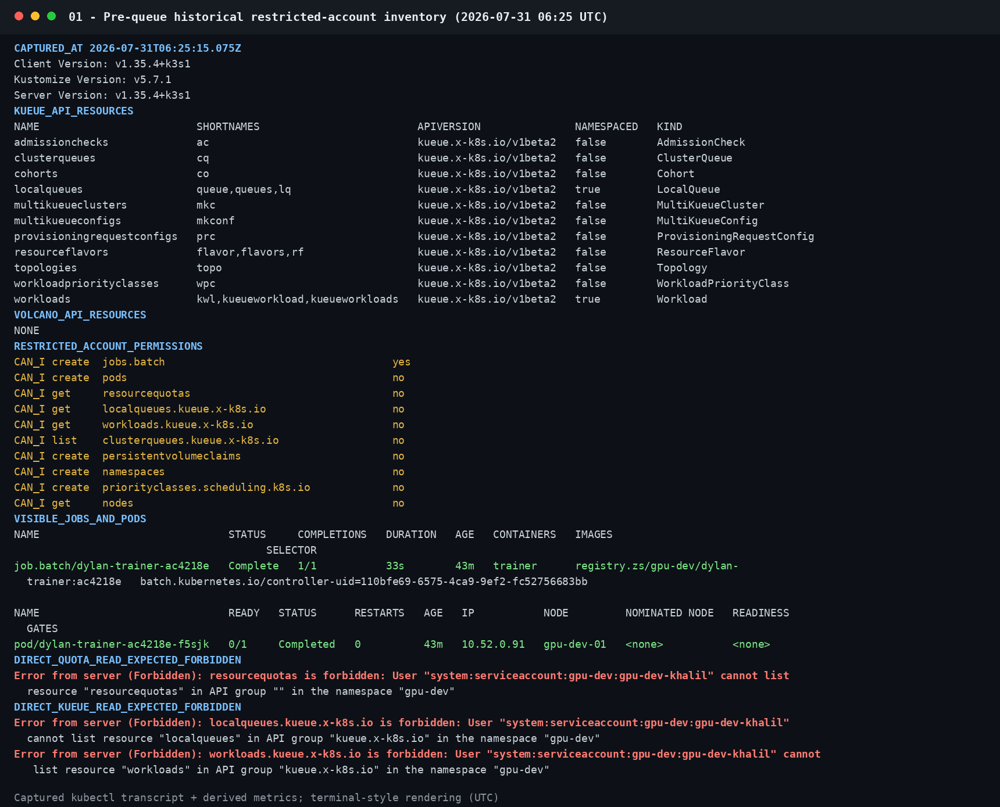
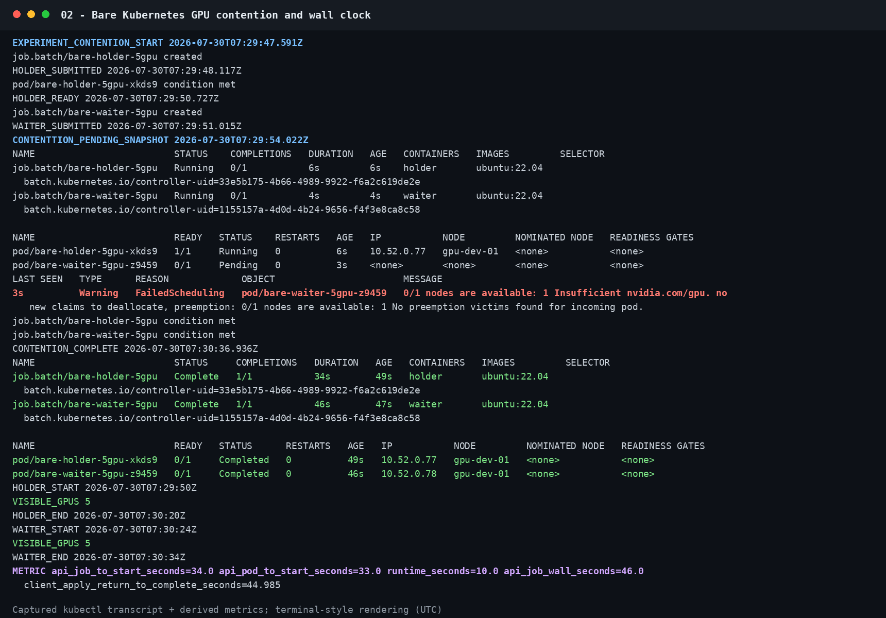
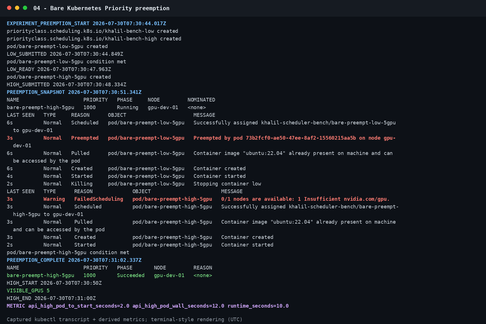
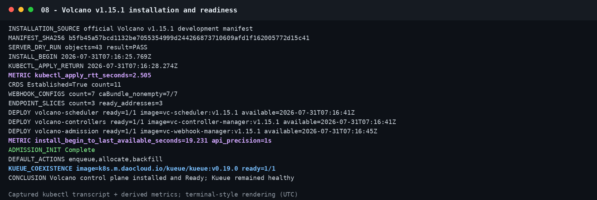
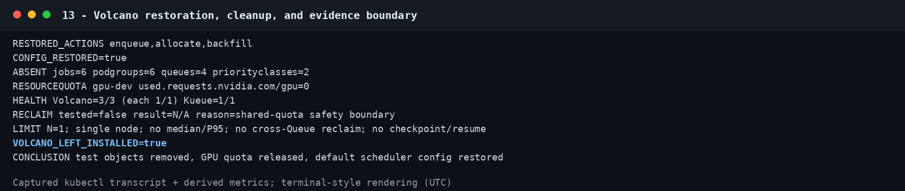

# GPU 调度功能实测记录（2026-07-31）

> 本文件保留 2026-07-31 调度功能测试明细。最终后端选型见 [GPU 集群训练后端执行选型评估报告](../GPU集群训练后端执行选型评估报告.md)。

> 核验日期：2026-07-31 UTC<br>
> 集群：k3s `v1.35.4+k3s1`，单节点 `gpu-dev-01`，8 张 NVIDIA GPU<br>
> 测试 namespace：`gpu-dev`，`requests.nvidia.com/gpu` ResourceQuota hard=`4`<br>
> Kueue：`v0.19.0`；Volcano：`v1.15.1`<br>
> 管理访问：`/etc/rancher/k3s/k3s.yaml`，context `default`；没有复制、打印或提交凭据内容

## 1. 最终结论

本轮已经补齐此前因权限不足而缺失的裸 Kubernetes 与 Kueue 测试，并完成 Volcano 安装和实测。结论不是文档能力推断，而是来自实际 Job、Workload、PodGroup、Pod、Event、CUDA stdout 和客户端 wall clock 的完整证据链。

1. **裸 Kubernetes 的 ResourceQuota 实际生效，但它不是批作业队列。** 4-GPU holder 占满 namespace quota 后，1-GPU waiter 的 Job 对象存在，但 Pod 创建被反复 `FailedCreate: exceeded quota`，快照中 waiter Pod 数为 0。holder 完成后 Job Controller 继续重试，waiter 才创建、绑定并完成 CUDA 计算。waiter API Job wall clock=`44s`，客户端提交开始到观察完成=`44.452s`。
2. **Kueue 的 GPU Admission、队列配额、整组准入和 Workload 抢占均实际生效。** Kueue `v0.19.0` 为 Job 创建 Workload，保留 quota 后解除挂起，Pod 仍由 `default-scheduler` 绑定。CUDA smoke 看见 1 GPU、Torch CUDA 可用、tensor 结果 42；API Job wall clock=`9s`。
3. **Kueue nominal quota 的等待不是物理 GPU 不足。** ClusterQueue nominal GPU=1、holder 使用 1 时，waiter Workload 为 Pending、Job 保持挂起、Pod 数为 0；当时节点仍有 7 GPU request headroom。holder 释放后 waiter 被 Admission 并运行，Workload 创建到 Admission=`23.789s`。
4. **Kueue 的 all-or-nothing quota admission 实际生效。** 两成员 Indexed Job 请求 2 GPU；nominal GPU=1 时整个 PodSet 不准入且 0 Pod，扩至 2 后整组 Admission，两个 Pod 的 Scheduled Event 相差 `0.010s`、应用启动相差 `0.103s`。这证明“整组配额准入”，不等于 Volcano 式物理 Gang barrier。
5. **Kueue 同 ClusterQueue 低优先级 Workload 抢占实际生效。** quota=3 时，Priority 100 的 3-GPU victim 已运行；Priority 1000 的 1-GPU Workload 到来后，Kueue 发出 `EvictedDueToPreempted` / `Preempted(reason=InClusterQueue)`，victim 被挂起和删除，高优先级 Job 随后运行并完成 CUDA。抢占前节点仍有 5 GPU headroom，因此这是 Kueue 逻辑 quota 抢占，不是 kube-scheduler 节点压力抢占。
6. **Volcano 已安装成功，GPU、Queue capability、PodGroup/Gang 和显式同 Queue preempt 均实际生效。** 官方 `v1.15.1` manifest 的 43 个对象通过 server-side dry-run；11/11 CRD Established、7/7 webhook CA 非空、3/3 EndpointSlice 有 ready address，scheduler/controller/admission 均 `1/1 Ready`。
7. **Volcano 默认没有启用抢占。** 官方安装后的 actions 是 `enqueue, allocate, backfill`。本轮只在受控场景临时改为 `allocate, backfill, preempt`，验证后已恢复默认。因此不能把“测试通过”写成“生产默认会抢占”。
8. **没有测试 Kueue Cohort borrowing/fair sharing/TAS，也没有测试 Volcano 跨 Queue reclaim、deserved borrowing 或长期公平性。** 这不是失败，而是当前单节点 8 GPU、共享 namespace quota=4 的安全边界无法在不绕过 quota 的情况下构造可信物理资源压力。
9. **wall-clock 只用于证明确实发生了等待、准入、绑定、启动和完成。** 每个场景 N=1、镜像已缓存、负载是短 CUDA 探针，不能据此给三种方案做性能排名，也没有 median/P95 或吞吐结论。

总判断：**裸 Kubernetes 适合最低运维面的单 Pod Job，但 ResourceQuota 只做硬门禁；Kueue 更适合保留默认 scheduler、为原生 Job 增加逻辑队列与 Workload 级策略；Volcano 更适合需要独立批调度器和 PodGroup/Gang 的场景。当前集群中 Kueue 与 Volcano 的核心 GPU 路径都已经得到端到端实证。**

## 2. 实测状态矩阵

| 能力 | 裸 Kubernetes | Kueue v0.19.0 | Volcano v1.15.1 |
|---|---|---|---|
| GPU/CUDA | **Pass**：quota 释放后 waiter CUDA=42 | **Pass**：Admission→绑定→CUDA=42 | **Pass**：Volcano 绑定→CUDA=42 |
| 显式批队列 | 不支持 | **Pass**：LocalQueue→ClusterQueue→Workload | **Pass**：Queue→PodGroup |
| GPU 配额 | **Pass**：ResourceQuota 硬拒绝 Pod 创建 | **Pass**：nominalQuota 挂起 Workload | **Pass**：Queue capability 阻止 binding |
| 释放后运行 | **Pass**：Job Controller 重试；非 FIFO 队列 | **Pass**：释放 quota 后 Admission | **Pass**：释放 capability 后 binding |
| 多成员整体行为 | 无作业级语义 | **Pass**：两成员 PodSet 整组 quota admission | **Pass**：`minMember`/`minResources` Gang 门槛 |
| 抢占 | 当前安全边界下未重跑节点压力抢占；有历史档案 | **Pass**：同 ClusterQueue Workload 抢占 | **Pass**：显式启用同 Queue preempt；默认关闭 |
| 跨队列借用/回收 | 不支持 | Cohort 未配置，**未测** | reclaim/deserved borrowing **未测** |
| 公平分享 | 无批作业公平策略 | **未测** | **未测** |
| 多节点拓扑 | **未测** | TAS **未测** | **未测** |
| checkpoint/resume | **未测** | **未测** | **未测** |

Volcano 安装前的受限账号快照曾显示 `VOLCANO_API NONE`。它是 2026-07-31 06:25 UTC 的历史证据，不代表安装后的现状；旧 Kueue gate 结果也已改名为 `pre-queue-kueue-results.json`，避免与本次成功实测混淆。



## 3. 机制与限制对比

| 维度 | 裸 Kubernetes | Kueue | Volcano |
|---|---|---|---|
| 定位 | 通用 Pod 调度 | Job/Workload 准入与逻辑配额 | 独立批处理 scheduler |
| 主链路 | Job→Pod→`default-scheduler` | Job→Workload Admission→解除挂起→`default-scheduler` | Job/PodGroup→`volcano` |
| 队列对象 | 无 | namespaced LocalQueue→cluster-scoped ClusterQueue | cluster-scoped Queue |
| GPU quota | namespace ResourceQuota hard ceiling | ResourceFlavor + nominalQuota；可选 Cohort | `capability`、`deserved`、`guarantee.resource` |
| 超限行为 | API 拒绝 Pod 创建，或 Pod Pending | Workload 未准入，Job 保持 suspend，通常 0 Pod | PodGroup/Pod 在 Queue 规则下等待 |
| 抢占粒度 | Pod Priority | Workload | Pod/PodGroup；同 Queue `preempt`、跨 Queue `reclaim` |
| Gang | 无原生 Job 级 Gang | 整组 quota admission；物理就绪还需 TAS/`waitForPodsReady` | PodGroup `minMember`/`minResources` |
| 借用/公平 | 无 | Cohort borrowing/lending、fair sharing | capacity/proportion/DRF 等插件 |
| 运维面 | 最小 | CRD、controller、webhook | CRD、scheduler、controller、webhook、scheduler config |

### 3.1 裸 Kubernetes

ResourceQuota 和队列有本质区别：

- ResourceQuota 只表达 namespace 的硬上限。永久超限时 Job 可以存在，但 Job Controller 创建 Pod 会反复失败。
- `default-scheduler` 的 pending queue 是内部调度数据结构，不是用户可配置的租户批队列；没有 LocalQueue、ClusterQueue、份额借用或作业级公平性。
- Pod Priority 抢占不知道训练作业边界。victim 的 CUDA 上下文会丢失，checkpoint、恢复和 wasted compute 由应用承担。

官方语义见 [Kubernetes ResourceQuota](https://kubernetes.io/docs/concepts/policy/resource-quotas/) 与 [Pod Priority and Preemption](https://kubernetes.io/docs/concepts/scheduling-eviction/pod-priority-preemption/)。

### 3.2 Kueue

Kueue 不替换 kube-scheduler。它先为 Workload 做 quota reservation/admission，再解除 Job 挂起，节点放置仍由默认 scheduler 完成。[Kueue Overview](https://kueue.sigs.k8s.io/docs/overview/)

因此要分开判断：

1. `QuotaReserved/Admitted=True` 说明逻辑额度已获得；
2. Pod `Scheduled` 说明节点放置成功；
3. 容器 CUDA 检测成功才说明 GPU runtime/device plugin 路径可用。

一个 Workload 即使逻辑总量可准入，也可能因单 Pod 请求无法落到任何节点而失败。多节点 GPU 场景需进一步评估 [Topology Aware Scheduling](https://kueue.sigs.k8s.io/v0.19/docs/concepts/topology_aware_scheduling/)。Kueue all-or-nothing 首先是 quota admission，不是容器原子同时启动；严格多 Pod 就绪还需 TAS、`waitForPodsReady`、超时和 requeue。[All-or-nothing](https://kueue.sigs.k8s.io/docs/concepts/all_or_nothing/)

### 3.3 Volcano

Volcano Queue 的字段不能混用：

- `capability`：Queue 硬上限，本轮已实测；
- `deserved`：capacity plugin 的软权益，可借用，紧张时超出部分可回收；
- `guarantee.resource`：不可借给其他 Queue 的保留资源；
- `weight`：proportion plugin 计算动态份额时使用。

Queue schema 与语义见 [v1.15.1 Queue API](https://github.com/volcano-sh/volcano/blob/v1.15.1/staging/src/volcano.sh/apis/pkg/apis/scheduling/v1beta1/types.go) 和 [Queue Resource Management](https://volcano.sh/docs/keyfeatures/queueresourcemanagement/)。

本轮原生 `batch/v1 Job` 通过 `schedulerName: volcano` 和显式 PodGroup 接入；scheduler 使用 `scheduling.k8s.io/group-name` 关联 PodGroup，Queue 由 `PodGroup.spec.queue` 指定。Volcano 官方默认 scheduler config 是：

```yaml
actions: "enqueue, allocate, backfill"
```

所以 PriorityClass 或 `reclaimable: true` 单独存在，不代表 `preempt`/`reclaim` 已启用。[v1.15.1 默认配置](https://github.com/volcano-sh/volcano/blob/v1.15.1/installer/helm/chart/volcano/config/volcano-scheduler.conf)

## 4. 裸 Kubernetes 当前实测

### 4.1 ResourceQuota 占满与释放

测试使用符合当前规则的两个 `batch/v1 Job`：holder 请求 4 GPU，waiter 请求 1 GPU。节点有 8 GPU，但 namespace hard quota 只有 4。

| 证据阶段 | 实际观察 |
|---|---|
| holder 运行 | quota used=4，容器实际看到 4 GPU |
| waiter Job 创建 | 成功，`spec.suspend=false` |
| holder 占满期间 | waiter Pod=0；出现 5 次 UID 匹配的 `FailedCreate: exceeded quota` |
| holder 容器结束 | `08:06:46` |
| holder Job Complete | `08:06:48` |
| waiter Pod 创建/Scheduled | `08:06:55` / `08:06:55.800082` |
| waiter容器开始/完成 | `08:06:58` / `08:07:06` |
| waiter Job Complete | `08:07:08` |

| wall-clock 指标 | 秒 |
|---|---:|
| client create RTT | `0.343` |
| API Job 创建→Pod 创建 | `31` |
| API Job 创建→容器开始 | `34` |
| 容器 runtime | `8` |
| 应用 CUDA runtime | `4.319` |
| API Job wall clock | `44` |
| client create begin→Complete observed | `44.452` |
| holder Job Complete→waiter Pod 创建 | `7` |

waiter 输出 `VISIBLE_GPU_COUNT=1`、`CUDA_TENSOR_RESULT=42`。


结论：**ResourceQuota 实际生效，但它通过拒绝 Pod 创建实现硬门禁；后续运行依赖 Job Controller 的退避重试。本次释放后额外等待 7s，不是可配置的 FIFO 队列延迟保证。**

### 4.2 当前未安全重跑节点压力抢占

节点有 8 GPU，而 `gpu-dev` hard quota=4。要制造 kube-scheduler 的 GPU 节点耗尽抢占，就必须绕过共享 quota 或使用其他 namespace，这超出本次安全授权。因此当前只把节点压力抢占标为“未测”。

仓库仍保留 2026-07-30 管理员历史档案：5-GPU holder/waiter 的 `Insufficient nvidia.com/gpu` 等待、GPU quota=1 而 Job 请求 2 的硬拒绝，以及 Priority 1000 的 5-GPU Pod 抢占 Priority 100 Pod。历史对象使用直接 Pod、独立 namespace 和不同镜像，不符合当前规则，runner 已阻断重跑，也不进入当前 wall-clock 横向比较。





## 5. Kueue 当前实测

### 5.1 先前未完成测试的根因

管理员诊断确认当时 namespace 中 LocalQueue 数为 0。诊断 Job 创建后 `0.896s` 内观察到 Workload，Job 保持 suspend、Pod=0，Workload 明确为：

```text
QuotaReserved=False
reason=Inadmissible
message="LocalQueue gpu-dev doesn't exist"
```

所以早期结果证明 gate 正常，却不是“可运行队列失败”。本轮临时创建了精确授权的 ResourceFlavor、ClusterQueue、LocalQueue 和 PriorityClass，完成全链路后逐名删除。

### 5.2 GPU Admission 与 CUDA

Kueue smoke 的 UID 过滤事件链：

```text
08:29:11.814657 CreatedWorkload
08:29:11.845784 QuotaReserved
08:29:11.845888 Admitted
08:29:11.874511 Pod Scheduled by default-scheduler
08:29:13        container Started
08:29:20        Job Complete
```

容器输出 `VISIBLE_GPU_COUNT=1`、Torch `2.13.0+cu130`、`TORCH_CUDA_AVAILABLE=true`、`CUDA_TENSOR_RESULT=42`。

| 指标 | 秒 |
|---|---:|
| client create RTT | `0.328` |
| API Job 创建→Scheduled Event | `0.875` |
| API Job 创建→容器开始 | `2` |
| 容器 runtime | `4` |
| 应用 CUDA runtime | `0.313` |
| API Job wall clock | `9` |
| client create begin→Complete observed | `8.934` |


结论：**Workload quota reservation、Admission、默认 scheduler 绑定、NVIDIA runtime/CUDA 和 Job 完成都实际生效。**

### 5.3 ClusterQueue GPU nominal quota

ClusterQueue `khalil-kueue-eval` 为 `StrictFIFO`，GPU nominal quota=1，无 Cohort；holder 与 waiter 各请求 1 GPU。

holder 运行时 ClusterQueue status 为 admitted=1、pending=1、GPU reservation total=1、borrowed=0。waiter Workload 为 `QuotaReserved=False/Pending`，消息明确为 `insufficient unused quota for nvidia.com/gpu`；Job suspend、waiter Pod=0。节点此时仍有 7 GPU request headroom。

holder释放后，waiter 于 `08:29:50.613452` Admission，`08:29:50.640980` 被默认 scheduler 绑定，CUDA 成功并 Complete。

| 指标 | 秒 |
|---|---:|
| Workload Created Event→Admitted | `23.789` |
| API Job 创建→容器开始 | `26` |
| 容器 runtime | `8` |
| 应用 runtime | `4.289` |
| API Job wall clock | `37` |
| client create begin→Complete observed | `37.155` |


结论：**Kueue 逻辑队列配额实际生效，并且可与物理节点资源是否充足明确区分。**

### 5.4 两成员 all-or-nothing admission

Indexed Job `parallelism=2/completions=2`，每个成员请求 1 GPU，Workload PodSet count=2：

- nominal quota=1 时，Workload 消息包含 `current podset request (2) > maximum capacity (1)`，Job suspend、Pod=0；
- quota 从 1 patch 到 2 后 `0.015s`（Event 时间口径）出现 Admission；
- 两 Pod Scheduled Event spread=`0.010s`；
- 两应用启动 spread=`0.103s`、结束 spread=`0.101s`；
- API Job wall clock=`21s`，client wall=`21.669s`，2/2 成功。


结论：**Kueue 整个两成员 PodSet 的 quota admission 实际生效。** Admission 后两个 Pod 由默认 scheduler 分别绑定；这不应写成 Volcano PodGroup 的物理 Gang barrier，也不能保证容器原子启动。

### 5.5 同 ClusterQueue Workload 抢占

受控场景把 GPU nominal quota 调为 3，并配置 `withinClusterQueue: LowerPriority`：

- victim：Priority 100，请求 3 GPU，Workload 已 Admission，Pod Running；
- preemptor：Priority 1000，请求 1 GPU；
- 节点物理 request headroom=5 GPU，故高优先级 Pod本可在物理节点放置，但逻辑 quota 无剩余；
- Kueue 对 victim Workload 发出 `EvictedDueToPreempted` 与 `Preempted(reason=InClusterQueue)`，Job 被重新 suspend、victim Pod 删除；
- high Workload 随后 Admission，默认 scheduler 绑定，CUDA=42 并完成。

| 指标 | 秒 |
|---|---:|
| high CreatedWorkload Event→victim Evicted Event | `0.023` |
| victim Evicted Event→high Admitted Event | `0.125` |
| client high create→观察 victim Evicted | `1.187` |
| client high create→观察 high Ready | `3.536` |
| API high Job 创建→容器开始 | `2` |
| high 容器 runtime / app runtime | `10` / `6.318` |
| API high Job wall clock | `15` |
| client high create→Complete observed | `15.625` |

core Event 的 `Killing` 只有秒级时间戳，不能用它与亚秒 Kueue Event 推断严格的毫秒顺序。


结论：**Kueue Workload/quota 抢占实际生效；这不是 kube-scheduler 节点压力抢占。** victim 没有完成 checkpoint/resume，不能推断真实训练抢占成本或无损恢复能力。

### 5.6 未测试的 Kueue 能力

本轮没有 Cohort，因此 borrowing/lending、reclaim within Cohort、admission fair sharing 均未测；`borrowed=0` 不能当作借用测试。单节点环境也没有测试 TAS。临时 LocalQueue/ClusterQueue/ResourceFlavor 已删除，所以**清理后的集群虽然 Kueue controller 健康，但 `gpu-dev` 当前没有可供生产提交的持久 LocalQueue**；正式启用前需管理员按生产策略重新配置。

## 6. Volcano 安装与实测

### 6.1 安装与变更控制

在用户确认的维护窗口内使用 `/etc/rancher/k3s/k3s.yaml`、context `default` 执行；没有读取到报告、复制或提交 kubeconfig 内容。该管理员配置不用于生产训练。检查时文件为 `0644 root:root`，本轮没有擅自修改，建议管理员单独收紧到 `0600`。

| 安装项 | 实际结果 |
|---|---:|
| 官方版本 | Volcano `v1.15.1` |
| manifest SHA-256 | `b5fb45a57bcd1132be7055354999d244266873710609afd1f162005772d15c41` |
| server-side dry-run | 43/43 对象通过 |
| `kubectl apply` RTT | `2.505s` |
| install begin→最后 Deployment Available | `19.231s`；condition 为秒级精度 |
| CRD | 11/11 `Established=True` |
| webhook | 7/7 CA bundle 非空 |
| EndpointSlice | 3 个，3 个 ready address |
| scheduler/controller/admission | 各 `1/1 Ready`，镜像均 `v1.15.1` |
| Kueue 共存 | `v0.19.0`，`1/1 Ready` |



治理文件 [AGENTS.md](../../AGENTS.md) 已记录标准 Volcano 系统资源/名称和本次测试 Queue、PodGroup、PriorityClass 的精确白名单。所有测试 Job 都在 `gpu-dev`、受 hard quota=4 约束，没有修改 Kueue、NVIDIA、存储或其他用户资源。

### 6.2 GPU binding 与 CUDA

原生 `batch/v1 Job` 的 Pod 由 `reportingComponent=volcano` 绑定到 `gpu-dev-01`。容器看到 RTX 5090、1 个可见 GPU、Torch CUDA=true、tensor=42。

| 指标 | 秒 |
|---|---:|
| client create RTT | `0.684` |
| API Job 创建→Volcano Scheduled | `1` |
| API Job 创建→容器开始 | `3` |
| 容器 runtime / app runtime | `8` / `7.898` |
| API Job wall clock | `14` |
| client create begin→Complete observed | `14.200` |


结论：**Volcano 的 GPU 调度和 CUDA 路径实际生效。**

### 6.3 Queue capability

Queue capability=1 GPU；1-GPU holder 已占用时，1-GPU waiter Pod Pending、`nodeName` 为空，PodGroup Pending，Volcano Event 明确为 `queue resource quota insufficient: insufficient nvidia.com/gpu`。节点仍有 7 GPU request headroom，故不是物理节点不足。holder 释放后 waiter 被绑定和运行。

waiter API create→Scheduled=`32s`、create→container start=`35s`、container runtime=`6s`、API Job wall=`44s`、client wall=`44.190s`。


结论：**Queue capability 硬上限实际生效。** ResourceQuota 对 Pending Pod request 也计费，所以快照 quota used=2；这与 Queue `allocated.gpu=1` 的语义不同。

### 6.4 PodGroup/Gang

PodGroup 配置 `minMember=2`、`minResources.gpu=2`，两个成员各请求 1 GPU。capability=1 时 2 Pod Pending、0 binding；扩到 2 后两个 Pod 在同一 API 秒由 Volcano Scheduled。应用启动 spread=`0.099s`，API Job wall=`24s`，client wall=`24.362s`。


结论：**低于门槛零 binding、达到门槛后两成员均绑定，Gang 门槛实际生效。** API 秒级时间戳不能证明容器原子启动。

### 6.5 显式同 Queue preempt

官方默认 actions 不含 preempt。本轮临时改为 `allocate, backfill, preempt`：Queue capability=3，Priority 100、3-GPU victim 被 Volcano 发出 `Evict: preempt`，随后 Priority 1000、1-GPU preemptor 绑定和 CUDA 成功。节点当时仍有 5 GPU request headroom，所以也是逻辑 Queue 抢占，而不是物理耗尽。

high API create→Scheduled=`1s`、create→container start=`5s`、container runtime=`8s`、API Job wall=`16s`、client wall=`16.071s`。victim 因 `backoffLimit:0` 失败，没有 checkpoint/resume。


实验后已恢复：

```yaml
actions: "enqueue, allocate, backfill"
```

所有 Volcano 测试 Jobs、PodGroups、Queues、PriorityClasses 均按精确名称删除；Volcano 系统保留安装。



### 6.6 未测试的 Volcano 能力

没有测试跨 Queue `reclaim`、capacity `deserved` 借用、`guarantee.resource`、capacity/proportion/DRF 长期公平性、GPU backfill、多节点拓扑或分布式训练。默认 actions 也不含 `reclaim`。这些能力只能引用官方文档，不能标 Pass。

## 7. Wall-clock 汇总与可比性

| 方案/场景 | 主要等待或准入 | container/app runtime | API Job wall | client wall | 验收结论 |
|---|---:|---:|---:|---:|---|
| 裸 K8s quota waiter | Job→Pod `31s`；Job→start `34s` | `8s` / `4.319s` | `44s` | `44.452s` | ResourceQuota hard gate Pass |
| Kueue CUDA smoke | Job→Scheduled `0.875s`；→start `2s` | `4s` / `0.313s` | `9s` | `8.934s` | Admission+GPU/CUDA Pass |
| Kueue queue waiter | Workload→Admitted `23.789s`；Job→start `26s` | `8s` / `4.289s` | `37s` | `37.155s` | nominal quota Pass |
| Kueue 2-member | patch→Admitted `0.015s`；schedule spread `0.010s` | app spread `0.103s` | `21s` | `21.669s` | all-or-nothing Admission Pass |
| Kueue preemptor | CreatedWL→victim evict `0.023s`；Job→start `2s` | `10s` / `6.318s` | `15s` | `15.625s` | Workload preempt Pass |
| Volcano CUDA smoke | Job→Scheduled `1s`；→start `3s` | `8s` / `7.898s` | `14s` | `14.200s` | GPU/CUDA Pass |
| Volcano queue waiter | Job→Scheduled `32s`；→start `35s` | `6s` | `44s` | `44.190s` | capability Pass |
| Volcano Gang 2-member | Job→both scheduled `9s`；→both start `13s` | app spread `0.099s` | `24s` | `24.362s` | Gang threshold Pass |
| Volcano preemptor | Job→Scheduled `1s`；→start `5s` | `8s` | `16s` | `16.071s` | explicit preempt Pass |

时间口径：

- Job/Pod/condition/core Event 多为秒级时间戳；亚秒 Event 使用 `eventTime`，客户端时长使用同进程 `time.monotonic_ns()`。
- 表格混合了不同业务 sleep、GPU 数和控制路径，只能证明功能链和等待阶段，不能以数字大小判断 scheduler 快慢。
- 每场景 N=1，镜像缓存命中，没有真实训练、PVC/IO、checkpoint、网络通信或多节点放置。
- 若要性能选择，应使用同一镜像、同一 GPU 数、同一训练数据/PVC 与运行时，每场景至少 5 次报告 median/range；要估计 P95，建议至少 20 次。

## 8. 存储与抢占风险

本次探针只写 stdout，不产生训练数据、缓存、日志、checkpoint 或持久输出，因此没有挂载 PVC。**Kueue 和 Volcano 都不会自动解决训练存储问题。** 生产训练提交前仍需管理员确认精确 PVC 及其非 root-disk 后端。

抢占会终止 CUDA 进程。当前 Kueue victim 被 suspend/删除，Volcano victim `Failed/BackoffLimitExceeded`；两边都没有验证 checkpoint、恢复次数、恢复耗时或最终模型一致性。因此：

- 默认不应为真实训练开启抢占；
- 应先验证 checkpoint 原子写、重启读取、数据加载可重复性和最大可接受 checkpoint age；
- 生产评估必须记录 victim 已运行时长、wasted GPU-seconds、恢复 wall clock 和最终完成时间，而不只记录 preemptor 多快启动。

## 9. 选型建议

- **单 Pod Job、最低运维面：** 裸 Kubernetes + ResourceQuota + 保守 PriorityClass 足够，但要接受没有显式批队列、公平份额和作业级抢占。
- **希望保留默认 scheduler，并给原生 Job 增加逻辑 quota、跨 namespace Queue/Cohort 和 Workload 策略：** 优先 Kueue。当前核心 GPU/Queue/preemption 已通过，但临时 Queue 已清理；生产前需设计持久 ClusterQueue/LocalQueue、Cohort 和 fair sharing。
- **刚性需要 PodGroup/Gang 或 Volcano 插件链：** Volcano 已在本集群完成安装和实测。它引入独立 scheduler/webhook 及全局 scheduler config，运维和变更风险高于 Kueue。

对 QuantFM 的建议：**不要用 N=1 短探针时延做替换决策。** 先确认训练是单 Pod 还是多 Pod、是否刚性需要 Gang、是否具备可恢复 checkpoint。若主要是原生单 Job 的租户 quota 与排队，Kueue 模型更轻；若是分布式训练且必须整组绑定，Volcano 的证据更直接。ResourceQuota 无论选择哪一种都继续保留为最终 namespace 硬护栏。

## 10. 清理、当前状态与复现

最终清理证据：

- 裸 K8s 2 个当前测试 Job 已 NotFound，namespace GPU quota used=0；
- Kueue 6 个测试 Job、LocalQueue、ClusterQueue、ResourceFlavor、2 个 PriorityClass 均逐名 NotFound；
- Volcano 6 个测试 Job、6 个 PodGroup、4 个 Queue、2 个 PriorityClass 均逐名 NotFound；
- Kueue controller `1/1 Ready`，Volcano 三个 Deployment `3/3` 健康；
- Volcano scheduler actions 已恢复 `enqueue, allocate, backfill`；Volcano 系统仍安装。


主要证据与代码：

```text
AGENTS.md
k8s/scheduler-evaluation/bare/admin-safe/
k8s/scheduler-evaluation/kueue/bench/
k8s/scheduler-evaluation/volcano/bench/
k8s/scheduler-evaluation/run_bare_admin_quota_evaluation.sh
k8s/scheduler-evaluation/run_kueue_gpu_evaluation.sh
k8s/scheduler-evaluation/run_volcano_gpu_evaluation.sh
k8s/scheduler-evaluation/run_volcano_cuda_smoke.sh
k8s/scheduler-evaluation/analyze_and_render.py
k8s/scheduler-evaluation/analyze_current_evaluations.py
k8s/scheduler-evaluation/analyze_volcano.py
docs/assets/gpu-scheduler-evaluation/current-bare-results.json
docs/assets/gpu-scheduler-evaluation/current-kueue-results.json
docs/assets/gpu-scheduler-evaluation/volcano-results.json
docs/assets/gpu-scheduler-evaluation/raw/
docs/assets/gpu-scheduler-evaluation/screenshots/
docs/assets/gpu-scheduler-evaluation/SHA256SUMS
```

截图是由真实 Kubernetes JSON/Event、容器 stdout 和 monotonic timeline 确定性渲染的 terminal-style 证据图，不是模拟效果图。用于结论的 Event 都按当次 Job/Workload/Pod/PodGroup UID 过滤，避免早先同名对象混入。

离线重新校验与渲染不会访问集群或读取 kubeconfig：

```bash
.venv/bin/python k8s/scheduler-evaluation/analyze_and_render.py
.venv/bin/python k8s/scheduler-evaluation/analyze_volcano.py
.venv/bin/python k8s/scheduler-evaluation/analyze_current_evaluations.py
cd docs/assets/gpu-scheduler-evaluation
sha256sum -c SHA256SUMS
```

管理员 kubeconfig 路径为 `/etc/rancher/k3s/k3s.yaml`，context 为 `default`。本次一次性 Kueue/Volcano 评估授权随证据、清理和报告完成而结束，不应用于无关操作或生产训练。

## 11. 官方参考

- [Kueue Overview](https://kueue.sigs.k8s.io/docs/overview/)
- [Kueue ClusterQueue](https://kueue.sigs.k8s.io/v0.19/docs/concepts/cluster_queue/)
- [Kueue LocalQueue](https://kueue.sigs.k8s.io/v0.19/docs/concepts/local_queue/)
- [Kueue Preemption](https://kueue.sigs.k8s.io/v0.19/docs/concepts/preemption/)
- [Kueue Admission Fair Sharing](https://kueue.sigs.k8s.io/docs/concepts/admission_fair_sharing/)
- [Kueue Kubernetes Job integration](https://kueue.sigs.k8s.io/v0.19/docs/tasks/run/jobs/)
- [Kueue All-or-nothing](https://kueue.sigs.k8s.io/docs/concepts/all_or_nothing/)
- [Kueue Topology Aware Scheduling](https://kueue.sigs.k8s.io/v0.19/docs/concepts/topology_aware_scheduling/)
- [Volcano Queue](https://volcano.sh/docs/concepts/queue/)
- [Volcano Queue Resource Management](https://volcano.sh/docs/keyfeatures/queueresourcemanagement/)
- [Volcano Scheduling Actions](https://volcano.sh/docs/scheduler/actions/)
- [Volcano PodGroup](https://volcano.sh/docs/concepts/podgroup/)
- [Volcano Gang plugin](https://volcano.sh/docs/scheduler/plugins/gang/)
- [Volcano v1.15.1 release](https://github.com/volcano-sh/volcano/releases/tag/v1.15.1)
- [Volcano v1.15.1 default scheduler config](https://github.com/volcano-sh/volcano/blob/v1.15.1/installer/helm/chart/volcano/config/volcano-scheduler.conf)
- [Kubernetes ResourceQuota](https://kubernetes.io/docs/concepts/policy/resource-quotas/)
- [Kubernetes Pod Priority and Preemption](https://kubernetes.io/docs/concepts/scheduling-eviction/pod-priority-preemption/)
